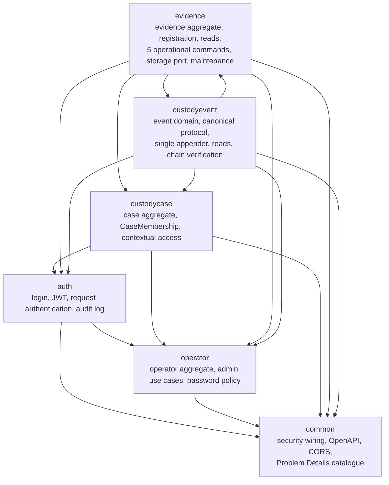
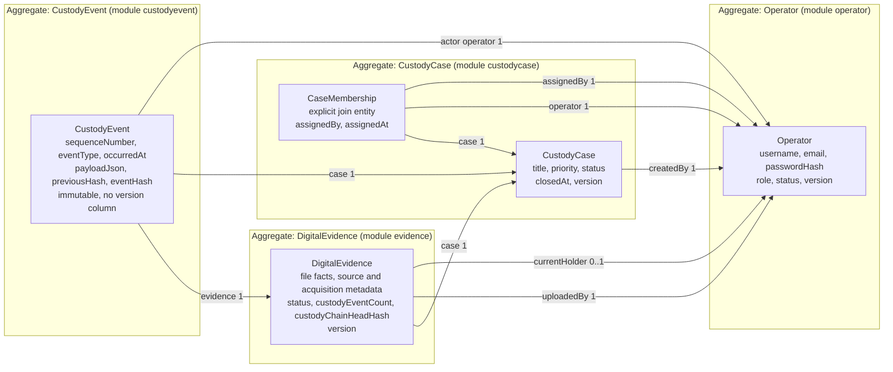
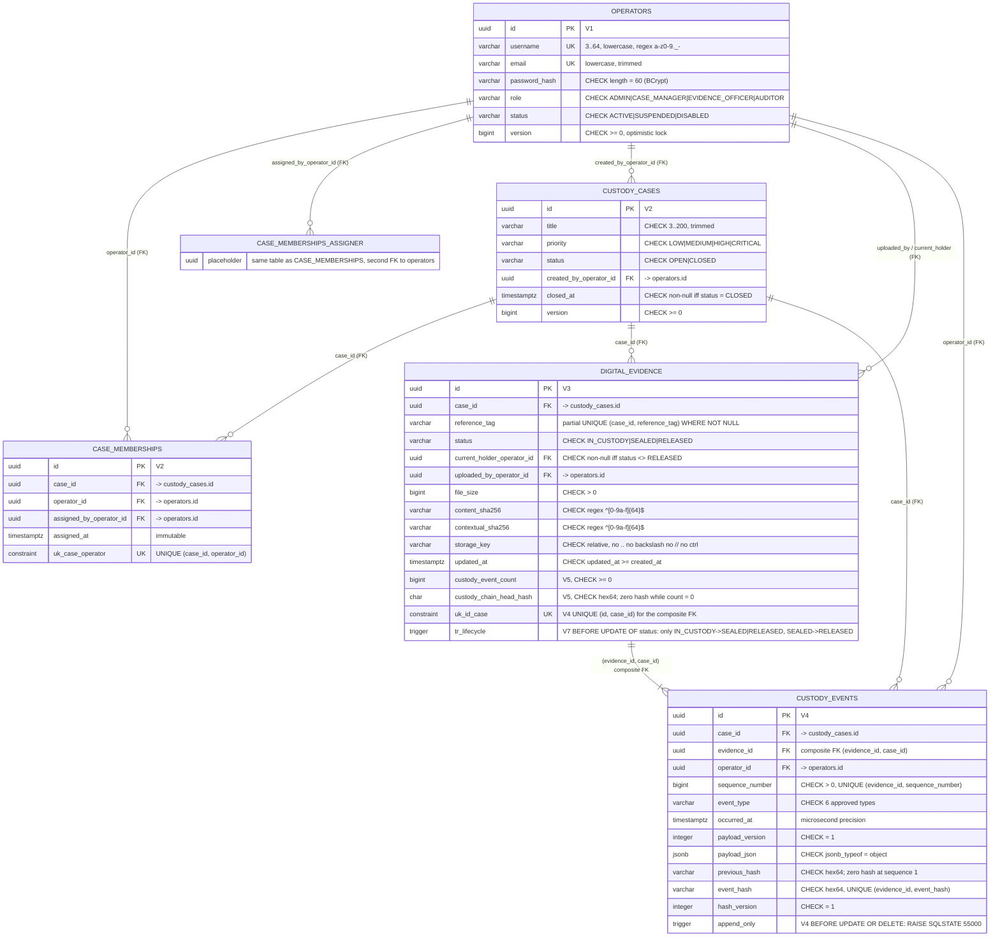
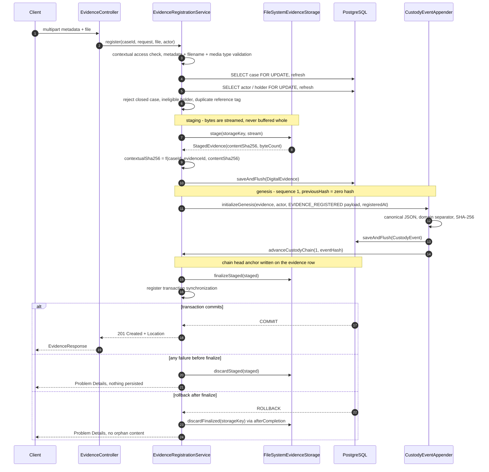
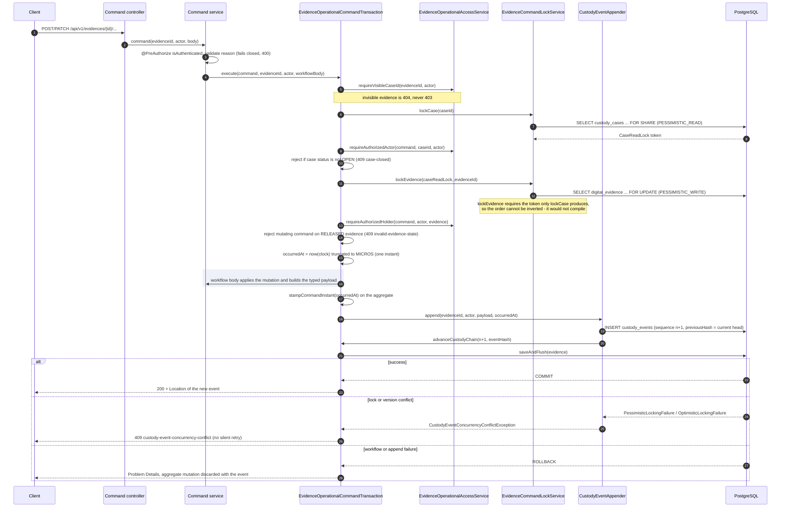
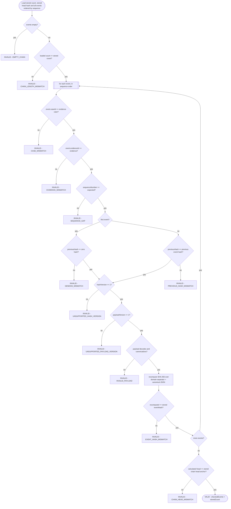
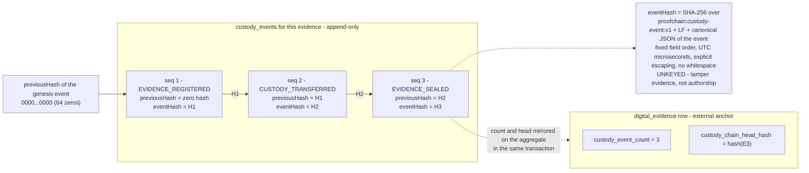

# ProofChain architecture

Version-controlled architecture diagrams for ProofChain `1.0.0`. Every diagram is rendered from Mermaid source in this
file and describes the code, migrations and configuration actually present in this repository.

ProofChain is a **single-process modular monolith backed by one PostgreSQL database**. The custody chain is a
per-evidence, hash-linked, append-only history stored in that one database. It is **not** a distributed ledger: there is
no peer network, no replication protocol, no consensus, no mining and no digital signature. None of the diagrams below
depicts one.

| # | Diagram | Kind |
| --- | --- | --- |
| 1 | [Module dependencies](#1-module-dependencies) | Flowchart |
| 2 | [Domain model and aggregate ownership](#2-domain-model-and-aggregate-ownership) | Flowchart |
| 3 | [Database schema from the Flyway migrations](#3-database-schema-from-the-flyway-migrations) | ER diagram |
| 4 | [Evidence registration](#4-evidence-registration) | Sequence |
| 5 | [Generic operational command](#5-generic-operational-command) | Sequence |
| 6 | [File integrity verification](#6-file-integrity-verification) | Sequence |
| 7 | [Custody-chain verification](#7-custody-chain-verification) | Flowchart |
| 8 | [Custody-chain structure](#8-custody-chain-structure) | Flowchart |

---

## 1. Module dependencies

Six feature packages under `it.itsprodigi.proofchain`. Arrows point from the dependent module to the module it uses.



Notes on the two edges that matter:

- `evidence -> custodyevent` exists because every operational command and the registration path append exactly one
  custody event through `CustodyEventAppender`.
- `custodyevent -> evidence` exists because the appender and the verifier both need the `DigitalEvidence` aggregate:
  it carries the chain anchor columns (`custody_event_count`, `custody_chain_head_hash`) and is the row that gets the
  `PESSIMISTIC_WRITE` lock.

That cycle is real. It is why the two remain packages inside one deployable rather than separately deployable modules:
the aggregate mutation and its event must commit or roll back together in one local transaction.

## 2. Domain model and aggregate ownership

Boxes grouped by the aggregate that owns them. Edge labels give the cardinality on the referenced side.



Read the cardinalities in the other direction as: one `CustodyCase` has `0..N` `CaseMembership` rows and `0..N`
`DigitalEvidence` rows; one `Operator` has `0..N` memberships, `0..N` created cases, `0..N` uploaded evidence items and
`0..N` currently held evidence items; one `DigitalEvidence` has `1..N` `CustodyEvent` rows — at least the genesis
event, since registration always appends it.

Ownership rules that the code enforces:

- `CaseMembership` is owned by the `custodycase` aggregate and is an **explicit entity**, not a `@ManyToMany`
  collection, because the assignment itself carries attributes (`assignedBy`, `assignedAt`).
- `DigitalEvidence` is its own aggregate root. It references its case but is not loaded as a collection on it — there is
  no `@OneToMany` mapping anywhere in the model; every association is a lazy `@ManyToOne` on the owning side.
- `CustodyEvent` is written only by `CustodyEventAppender`, only inside a caller's transaction, and never mutated.
- No entity in the model is mapped with `@OneToOne` or `@ManyToMany`. That is a modelling outcome, not an oversight;
  see [ITS compliance](./ITS-Compliance.md).

## 3. Database schema from the Flyway migrations

Derived directly from `V1`–`V7` under `src/main/resources/db/migration` plus the Java migration `V6`. Only the
constraints that carry a rule are listed; the full text is in the migrations themselves.



`CASE_MEMBERSHIPS_ASSIGNER` is not a table. Mermaid cannot draw two distinct relationships between the same pair of
entities, so the second foreign key from `case_memberships.assigned_by_operator_id` to `operators.id` is shown as a
separate node. There are exactly five tables: `operators`, `custody_cases`, `case_memberships`, `digital_evidence`,
`custody_events`, plus Flyway's own `flyway_schema_history`.

The two triggers are the enforcement of last resort:

- `custody_events_append_only` (`V4`) makes the event table physically append-only: any `UPDATE` or `DELETE` raises
  SQLSTATE `55000`, whatever the client.
- `tr_digital_evidence_lifecycle_transition` (`V7`) rejects any status change outside the lifecycle graph with a
  `check_violation` named `ck_digital_evidence_lifecycle_transition`. The application never reaches it, because seal
  and release validate under the evidence write lock first; it exists so that a repair script or a manual `psql`
  session cannot un-seal or reopen released evidence either.

## 4. Evidence registration

`POST /api/v1/cases/{caseId}/evidences`, implemented by `EvidenceRegistrationService`. One transaction, plus a
transaction synchronization for the filesystem outcome.



The genesis event's `occurredAt` is asserted to equal the evidence `createdAt`; `initializeGenesis` refuses to run
unless the chain is provably empty (count `0`, head is the zero hash, no stored event).

## 5. Generic operational command

The shared template `EvidenceOperationalCommandTransaction`, used unchanged by transfer, metadata update, integrity
verification, seal and release. Only the highlighted "workflow body" differs per command.



## 6. File integrity verification

`POST /api/v1/evidences/{evidenceId}/verify-integrity`. It reuses the whole template above; this diagram shows only the
workflow body and the verdict rules.

```mermaid
sequenceDiagram
    autonumber
    participant TX as Command template (locks held)
    participant SVC as EvidenceIntegrityVerificationService
    participant FS as FileSystemEvidenceStorage
    participant APP as CustodyEventAppender

    TX->>SVC: workflow body (case read lock + evidence write lock held)
    SVC->>SVC: read expected contentSha256 and fileSize from the locked row
    SVC->>FS: open(storageKey)

    alt file missing, non-regular, unreadable or unsafe path
        FS-->>SVC: IOException / UnsafeEvidenceStoragePathException
        SVC-->>TX: EvidenceFileUnavailableException
        Note over SVC,TX: 500 evidence-file-unavailable, transaction aborts,<br/>NO event is appended
    else file opens
        loop 8 KiB buffer, single streaming pass
            FS-->>SVC: bytes
            SVC->>SVC: digest.update(...) and byteCount += read
        end

        alt byteCount == 0
            SVC-->>TX: EvidenceFileUnavailableException
            Note over SVC,TX: known limitation: a readable zero-byte file is reported as a<br/>technical inability, not as valid=false, because the frozen<br/>IntegrityVerifiedPayload requires a positive fileSize
        else byteCount > 0
            SVC->>SVC: valid = (expectedSha == actualSha) AND (expectedSize == actualSize)
            SVC->>SVC: stampCommandInstant(occurredAt)
            SVC->>APP: INTEGRITY_VERIFIED payload (algorithm, expected, actual, valid, fileSize)
            APP-->>TX: event appended, chain advanced
            TX-->>SVC: 200 with valid true or false
            Note over TX,SVC: a mismatch is a SUCCESSFUL verification with valid=false,<br/>never an error; no stored hash, size or byte is ever rewritten
        end
    end
```

## 7. Custody-chain verification

`POST /api/v1/evidences/{evidenceId}/verify-chain`, implemented by `CustodyChainVerifier`. Side-effect-free: it never
mutates, and it never throws for corrupt stored data — every diagnosable failure comes back as a verdict. Reasons are
evaluated in strict precedence order and evaluation stops at the first violation.



A technical inability to read the chain at all is different from a verdict: it surfaces as
`custody-chain-read-failure` (500) rather than as `valid: false`.

## 8. Custody-chain structure

The stored shape of one evidence item's chain. Every evidence item has its own independent chain; there is no shared
or global ledger, and nothing is replicated anywhere.



Why the external anchor exists: a chain alone cannot detect events removed from its tail — the remaining events would
still link correctly. `custody_event_count` and `custody_chain_head_hash` live on the `digital_evidence` row and are
updated inside the same transaction as the append, so a deleted tail shows up immediately as `CHAIN_LENGTH_MISMATCH` or
`CHAIN_HEAD_MISMATCH`.

What the chain does and does not prove:

- **Does prove** that the stored events are internally consistent with one another and with the anchor, so any edit,
  reordering, insertion or deletion is detectable by recomputation.
- **Does not prove** authorship or origin. The hash is unkeyed and there is no signature, no key material and no
  external timestamp authority. An actor able to rewrite the whole table and the anchor could produce a consistent
  chain. The append-only trigger, the `updatable = false` mappings and the absence of any write route are what make
  that require direct, privileged database access rather than an API call.

---

## Related documents

- [Technical report](./Technical-Report.md) — the full narrative these diagrams illustrate.
- [Custody Events](./Custody-Events.md) — protocol details, typed payloads and the reproducible fixed vector.
- [Operational Custody Workflows](./Operational-Custody-Workflows.md) — the authorization matrix and per-command contracts.
- [Database schema lifecycle](./Database-Schema-Lifecycle.md) — certified baselines, upgrade paths and recovery.
- [ADR index](./adr/README.md) — the decisions behind these structures.
