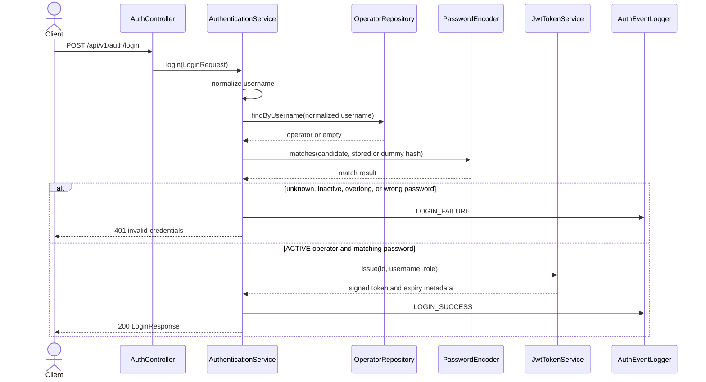

# Authentication

## Purpose

ProofChain needs to identify the operator behind a request before protected custody data can be exposed or changed. The authentication slice accepts credentials, issues short-lived access tokens, validates bearer tokens, builds the request principal, and reports authentication events without recording secrets.

Authentication answers “who is making this request?” and establishes the current global role used by authorization. It does not create operators, choose their roles, or change their status. Those administrative responsibilities belong to [Operator Management](./Operators.md). Case membership and evidence-specific permissions are not implemented in the current sprint.

## Authentication architecture

[`AuthController`](../src/main/java/it/itsprodigi/proofchain/auth/api/AuthController.java) exposes login and the current-operator endpoint. Its request and response records keep the HTTP contract separate from the persisted `Operator` entity. For login, the controller delegates to [`AuthenticationService`](../src/main/java/it/itsprodigi/proofchain/auth/application/AuthenticationService.java), which normalizes the username, loads the operator through [`OperatorRepository`](../src/main/java/it/itsprodigi/proofchain/operator/persistence/OperatorRepository.java), performs a BCrypt comparison, requires `ACTIVE` status, and asks [`JwtTokenService`](../src/main/java/it/itsprodigi/proofchain/auth/application/JwtTokenService.java) to issue the token.

[`PasswordSecurityConfig`](../src/main/java/it/itsprodigi/proofchain/common/config/PasswordSecurityConfig.java) creates the shared `BCryptPasswordEncoder`. [`JwtConfig`](../src/main/java/it/itsprodigi/proofchain/auth/config/JwtConfig.java) validates the external signing configuration and creates the HS256 key and UTC clock.

On later requests, [`JwtAuthenticationFilter`](../src/main/java/it/itsprodigi/proofchain/auth/security/JwtAuthenticationFilter.java) validates the header and token, reloads the operator, and creates an immutable [`AuthenticatedOperator`](../src/main/java/it/itsprodigi/proofchain/auth/security/AuthenticatedOperator.java). [`SecurityConfig`](../src/main/java/it/itsprodigi/proofchain/common/config/SecurityConfig.java) installs that filter in a stateless Spring Security chain and enables method security. [`ProblemAuthenticationEntryPoint`](../src/main/java/it/itsprodigi/proofchain/auth/security/ProblemAuthenticationEntryPoint.java), [`ProblemAccessDeniedHandler`](../src/main/java/it/itsprodigi/proofchain/auth/security/ProblemAccessDeniedHandler.java), and [`SecurityProblemWriter`](../src/main/java/it/itsprodigi/proofchain/auth/security/SecurityProblemWriter.java) preserve the same Problem Details vocabulary at the security boundary used by MVC errors.

Authentication events converge on [`AuthEventLogger`](../src/main/java/it/itsprodigi/proofchain/auth/logging/AuthEventLogger.java). This keeps formatting, sanitization, and the dedicated `AUTH_AUDIT` destination out of controllers, services, and filters.

## Login flow

`POST /api/v1/auth/login` is public. The JSON body contains `username` and `password`; both are required and non-blank.

The username is trimmed and lower-cased with `Locale.ROOT`. The repository lookup therefore uses the same canonical form stored by the operator domain. Password comparison still occurs for an unknown username: the service uses a BCrypt dummy hash so the public outcome does not disclose whether an account exists. Passwords exceeding BCrypt's 72-byte UTF-8 boundary also use the dummy comparison.

Only an `ACTIVE` operator with a matching password can receive a token. Unknown usernames, wrong passwords, overlong passwords, `SUSPENDED` operators, and `DISABLED` operators all produce the same `invalid-credentials` response. On success, the response contains `accessToken`, the token type `Bearer`, `expiresAt`, and `expiresInSeconds`. The controller adds `Cache-Control: no-store` and `Pragma: no-cache`.

## JWT model

ProofChain signs access tokens with HS256 through JJWT 0.13.0. `PROOFCHAIN_JWT_SECRET` must be standard Base64 whose decoded value is at least 32 bytes; the value is external configuration and must never appear in source, documentation examples, or logs. The default TTL is 30 minutes (`PT30M`) and must be positive. The fixed issuer is `proofchain-api`.

The accepted claim set is exact:

| Claim | Value |
| --- | --- |
| `sub` | Operator UUID |
| `username` | Normalized username |
| `role` | Global role at issuance |
| `iat` | Issuance time, truncated to seconds |
| `exp` | Expiration time, truncated to seconds |
| `jti` | Random UUID version 4 |
| `iss` | `proofchain-api` |

Email, names, status, password data, and detailed privileges are excluded. The token is deliberately limited to identity and issuance metadata; mutable authorization is not trusted from it. Although `username` and `role` are signed, the request filter uses the subject UUID to reload the operator and constructs authorities from the database record.

Validation verifies the signature with the configured key, requires HS256 and the fixed issuer, rejects claims outside the allowlist, checks UUID and normalized-username formats, rejects a future `iat`, and requires `exp` to be later than `iat`. JJWT reports an elapsed `exp` separately so ProofChain can return the `expired-token` contract.

## Authenticated request flow

For every request, the filter first clears the thread-local security context. If no `Authorization` header is present, it performs no database lookup and lets the chain treat the request as anonymous. If the header is present, exactly one value in the form `Bearer <token>` is accepted; duplicate headers, whitespace inside the token, commas, and other schemes are invalid.

The complete protected-request path is:

1. Read all `Authorization` header values.
2. Require exactly one value matching the Bearer syntax.
3. Parse the JWT and validate its signature, algorithm, issuer, claims, and timestamps.
4. Extract the operator UUID from `sub`.
5. Call `OperatorRepository.findById`.
6. Reject a missing record or any status other than `ACTIVE`.
7. Build `AuthenticatedOperator` from the current database fields.
8. Create a `UsernamePasswordAuthenticationToken` with the current `ROLE_<role>` authority.
9. Install it in a new `SecurityContext` and continue the filter chain.
10. Apply URL authentication rules, followed by method authorization such as `hasRole('ADMIN')`.

This database lookup occurs on every request that presents a syntactically valid bearer token. It makes disablement, suspension, role changes, deletion, and any resulting privilege change effective on the next request, even when the token has not expired. A demoted ADMIN remains authenticated but receives `403` on ADMIN-only operations; a suspended, disabled, or deleted operator receives `401 invalid-token`.

## Current operator endpoint

`GET /api/v1/auth/me` requires bearer authentication and returns the database-backed identity selected for the current request. [`CurrentOperatorResponse`](../src/main/java/it/itsprodigi/proofchain/auth/api/CurrentOperatorResponse.java) contains `id`, `username`, `email`, `firstName`, `lastName`, `role`, `status`, `createdAt`, and `updatedAt`. It does not expose the password hash or JPA version.

The response is mapped from `AuthenticatedOperator`, which the filter has just built from the current `Operator` row; it is not reconstructed from token claims. A missing token produces `authentication-required`. An invalid or expired token produces its specific `401` problem. If the operator has been deleted or is no longer `ACTIVE`, the request is rejected as `invalid-token` before the controller runs.

## Security configuration

The servlet security chain uses `SessionCreationPolicy.STATELESS`, a `NullSecurityContextRepository`, and a `NullRequestCache`. Form login, HTTP Basic, remember-me, logout, CSRF, and implicit security-context persistence are disabled. CSRF is disabled because this API authenticates requests with an explicit bearer token rather than a browser session cookie; the tests also verify that authenticated requests create neither a session nor a `Set-Cookie` header.

The JWT filter is created inside the security-chain configuration and placed before `AnonymousAuthenticationFilter`. This gives a valid bearer token a principal before anonymous authentication is considered, without separately registering the filter as a servlet filter.

The public URL set is limited to `/api/v1/auth/login`, `/v3/api-docs/**`, `/swagger-ui/**`, `/swagger-ui.html`, and error dispatches. Every other URL requires authentication. `@EnableMethodSecurity` then applies use-case authorization; operator administration is protected by `@PreAuthorize("hasRole('ADMIN')")` on application-service methods.

Authentication failure means no acceptable active identity was established and returns `401`. Authorization failure means an authenticated identity lacks the required authority and returns `403`. Missing authentication is handled by `ProblemAuthenticationEntryPoint`; access denial is handled by the configured handler or, for method-security exceptions raised during MVC execution, by `GlobalExceptionHandler`.

## Password security

The shared encoder is BCrypt. Production defaults to strength 12; the test profile lowers it to 4 to keep test execution practical. [`PasswordPolicy`](../src/main/java/it/itsprodigi/proofchain/operator/application/PasswordPolicy.java) applies configurable minimum and maximum character counts and also enforces BCrypt's maximum of 72 UTF-8 bytes. The defaults are 12 and 128 Unicode code points, but the 72-byte ceiling can be reached first for multibyte characters.

Login does not reapply the creation policy to an existing password. It enforces the BCrypt byte ceiling and compares against the stored hash or a prepared dummy hash. Passwords and hashes are excluded from response DTOs, `Operator.toString()`, and authentication event fields. They must not be added to application logs or evidence.

The same policy and encoder are used when an ADMIN creates an operator and when the initial administrator is bootstrapped.

## Initial administrator bootstrap

[`BootstrapAdminRunner`](../src/main/java/it/itsprodigi/proofchain/operator/application/BootstrapAdminRunner.java) invokes [`BootstrapAdminService`](../src/main/java/it/itsprodigi/proofchain/operator/application/BootstrapAdminService.java) during application startup. Bootstrap is disabled by default and reads only externalized `proofchain.bootstrap.admin.*` properties.

When enabled, the service locks the current `ACTIVE ADMIN` rows. If at least one exists, it skips creation without changing that operator; this is the implemented idempotency boundary. Otherwise it requires username, email, and password, normalizes the two identity fields, validates and hashes the password, and creates an `ACTIVE ADMIN` named `Initial Administrator`. Completion is logged after transaction commit.

The service does not search for the configured username independently of the active-admin check. Consequently, the documented safe use is initial provisioning only: enable it to create the first administrator, verify creation, then disable it. Credentials remain environment values and must not be committed.

## Authentication logging

The closed [`AuthEvent.Event`](../src/main/java/it/itsprodigi/proofchain/auth/logging/AuthEvent.java) set contains `LOGIN_SUCCESS`, `LOGIN_FAILURE`, `INVALID_TOKEN`, `EXPIRED_TOKEN`, `ACCESS_DENIED`, `INACTIVE_OPERATOR_ACCESS`, `BOOTSTRAP_ADMIN_COMPLETED`, and `BOOTSTRAP_ADMIN_SKIPPED`. [`logback-spring.xml`](../src/main/resources/logback-spring.xml) sends the `AUTH_AUDIT` logger to the ignored local file `auth.log` at INFO level with additivity disabled, so these events do not propagate to the normal console logger.

Each record has a stable order for event, operator ID, username, role, outcome, reason, and path. Success identifies the authenticated operator. Credential failure uses the shared `INVALID_CREDENTIALS` reason. Invalid and expired tokens are distinct events, inactive operators produce a denied event, and insufficient authority produces `ACCESS_DENIED`.

[`LogValueSanitizer`](../src/main/java/it/itsprodigi/proofchain/auth/logging/LogValueSanitizer.java) removes ISO control characters, limits usernames to 64 code points and paths to 512, limits reasons to 128, and replaces email-like usernames with `-`. Passwords, hashes, complete JWTs, signatures, signing secrets, complete `Authorization` headers, and request bodies are not accepted as event fields. Logging failures are contained so they cannot change an authentication result. This file is an operational diagnostic destination, not a durable audit database or retention system.

## Error contracts

Authentication and security errors use `application/problem+json`. Every response includes `type`, `title`, `status`, `detail`, request `instance`, and a UTC `timestamp`.

| Situation | HTTP | Problem type | Implemented behavior |
| --- | --- | --- | --- |
| Unknown username, wrong password, inactive operator at login, or overlong password | `401` | `https://proofchain.dev/problems/invalid-credentials` | One public contract prevents account-state disclosure. |
| Missing token on a protected route | `401` | `https://proofchain.dev/problems/authentication-required` | No operator lookup is attempted. |
| Malformed token/header, wrong signature/issuer/claims, deleted operator, or inactive operator on a bearer request | `401` | `https://proofchain.dev/problems/invalid-token` | The security context is cleared. |
| Expired token | `401` | `https://proofchain.dev/problems/expired-token` | Expiration is distinguished from other token failures. |
| Authenticated operator without the required role | `403` | `https://proofchain.dev/problems/access-denied` | The denial is also sent to `AUTH_AUDIT`. |

`SUSPENDED` and `DISABLED` are intentionally not disclosed during login. On a request with an already-issued token, both are reported publicly as `invalid-token`; the local audit event records the inactive-operator boundary without exposing credentials or token material.

## Configuration reference

| Property / environment variable | Required | Default | Purpose | Security note |
| --- | --- | --- | --- | --- |
| `proofchain.jwt.secret` / `PROOFCHAIN_JWT_SECRET` | Yes | Empty, rejected at startup | HS256 signing and verification key | Standard Base64; decoded value must be at least 32 bytes. Never commit or log it. |
| `proofchain.jwt.access-token-ttl` / `PROOFCHAIN_JWT_ACCESS_TOKEN_TTL` | No | `PT30M` | Access-token lifetime | Must be a positive ISO-8601 duration. |
| `proofchain.password.min-length` / `PROOFCHAIN_PASSWORD_MIN_LENGTH` | No | `12` | Minimum password code points | Must be positive and no greater than the maximum. |
| `proofchain.password.max-length` / `PROOFCHAIN_PASSWORD_MAX_LENGTH` | No | `128` | Maximum password code points | BCrypt still imposes a 72-byte UTF-8 ceiling. |
| `proofchain.password.bcrypt-strength` / `PROOFCHAIN_BCRYPT_STRENGTH` | No | `12` (`4` in tests) | BCrypt work factor | Accepted range is 4 through 31; higher values cost more CPU. |
| `proofchain.bootstrap.admin.enabled` / `PROOFCHAIN_BOOTSTRAP_ADMIN_ENABLED` | No | `false` | Enables initial-admin creation at startup | Keep disabled after initial provisioning. |
| `proofchain.bootstrap.admin.username` / `PROOFCHAIN_BOOTSTRAP_ADMIN_USERNAME` | When bootstrap creates an admin | Empty | Initial normalized username | Not an email login; stored lower-case and trimmed. |
| `proofchain.bootstrap.admin.email` / `PROOFCHAIN_BOOTSTRAP_ADMIN_EMAIL` | When bootstrap creates an admin | Empty | Initial normalized email | Treated as identity data; do not place it in public evidence unnecessarily. |
| `proofchain.bootstrap.admin.password` / `PROOFCHAIN_BOOTSTRAP_ADMIN_PASSWORD` | When bootstrap creates an admin | Empty | Initial administrator password | Validated and BCrypt-hashed; never commit or log it. |
| `AUTH_AUDIT` logger in `logback-spring.xml` | Fixed configuration | `auth.log`, INFO | Local authentication event destination | No environment override is implemented; `auth.log` is ignored and is not a retention system. |

The repository's safe placeholders are listed in [`.env.example`](../.env.example). Spring resolves these values; application code does not call `System.getenv()`.

## Testing coverage

Authentication is tested at several boundaries:

- [`AuthenticationServiceTest`](../src/test/java/it/itsprodigi/proofchain/auth/application/AuthenticationServiceTest.java) covers normalized login, unknown usernames, wrong passwords, inactive operators, the BCrypt byte limit, dummy comparisons, and response mapping.
- [`JwtTokenServiceTest`](../src/test/java/it/itsprodigi/proofchain/auth/application/JwtTokenServiceTest.java) and [`JwtConfigurationTest`](../src/test/java/it/itsprodigi/proofchain/auth/config/JwtConfigurationTest.java) cover token round trips, claim allowlisting, malformed and expired tokens, key requirements, TTL, and the production clock.
- [`JwtAuthenticationFilterTest`](../src/test/java/it/itsprodigi/proofchain/auth/security/JwtAuthenticationFilterTest.java) covers header parsing, one database lookup, current database role, missing/deleted/inactive operators, and invalid versus expired responses.
- [`AuthControllerWebMvcTest`](../src/test/java/it/itsprodigi/proofchain/auth/api/AuthControllerWebMvcTest.java) verifies login JSON and cache headers, uniform credential errors, `/auth/me`, and its OpenAPI security contract.
- [`AuthenticationFlowIT`](../src/test/java/it/itsprodigi/proofchain/auth/api/AuthenticationFlowIT.java) and [`DatabaseBackedAuthenticationIT`](../src/test/java/it/itsprodigi/proofchain/DatabaseBackedAuthenticationIT.java) use PostgreSQL to verify login and immediate status, role, and deletion effects on already-issued tokens.
- [`AuthEventLoggerTest`](../src/test/java/it/itsprodigi/proofchain/auth/logging/AuthEventLoggerTest.java) and [`LogValueSanitizerTest`](../src/test/java/it/itsprodigi/proofchain/auth/logging/LogValueSanitizerTest.java) verify stable event formatting, sanitization, truncation, sensitive-value exclusion, and failure containment.
- [`SecurityBoundaryWebMvcTest`](../src/test/java/it/itsprodigi/proofchain/SecurityBoundaryWebMvcTest.java) verifies public/protected routes, exact `401`/`403` Problem Details, stateless requests, and the OpenAPI bearer scheme.
- [`AuthenticationVerticalSliceIT`](../src/test/java/it/itsprodigi/proofchain/auth/AuthenticationVerticalSliceIT.java) certifies bootstrap, login, `/auth/me`, frozen failure contracts, OpenAPI metadata, and sanitized audit events across the running application and Testcontainer database.

## Relevant source files

- HTTP API: [`AuthController`](../src/main/java/it/itsprodigi/proofchain/auth/api/AuthController.java), [`LoginRequest`](../src/main/java/it/itsprodigi/proofchain/auth/api/LoginRequest.java), [`LoginResponse`](../src/main/java/it/itsprodigi/proofchain/auth/api/LoginResponse.java), and [`CurrentOperatorResponse`](../src/main/java/it/itsprodigi/proofchain/auth/api/CurrentOperatorResponse.java).
- Login and JWT application logic: [`AuthenticationService`](../src/main/java/it/itsprodigi/proofchain/auth/application/AuthenticationService.java), [`JwtTokenService`](../src/main/java/it/itsprodigi/proofchain/auth/application/JwtTokenService.java), and [`JwtConfig`](../src/main/java/it/itsprodigi/proofchain/auth/config/JwtConfig.java).
- Request security: [`JwtAuthenticationFilter`](../src/main/java/it/itsprodigi/proofchain/auth/security/JwtAuthenticationFilter.java), [`AuthenticatedOperator`](../src/main/java/it/itsprodigi/proofchain/auth/security/AuthenticatedOperator.java), and [`SecurityConfig`](../src/main/java/it/itsprodigi/proofchain/common/config/SecurityConfig.java).
- Security errors: [`SecurityProblemWriter`](../src/main/java/it/itsprodigi/proofchain/auth/security/SecurityProblemWriter.java), [`GlobalExceptionHandler`](../src/main/java/it/itsprodigi/proofchain/common/exception/GlobalExceptionHandler.java), and [`ProblemTypes`](../src/main/java/it/itsprodigi/proofchain/common/exception/ProblemTypes.java).
- Password and bootstrap: [`PasswordPolicy`](../src/main/java/it/itsprodigi/proofchain/operator/application/PasswordPolicy.java), [`PasswordSecurityProperties`](../src/main/java/it/itsprodigi/proofchain/common/config/PasswordSecurityProperties.java), and [`BootstrapAdminService`](../src/main/java/it/itsprodigi/proofchain/operator/application/BootstrapAdminService.java).
- Authentication events: [`AuthEvent`](../src/main/java/it/itsprodigi/proofchain/auth/logging/AuthEvent.java), [`AuthEventLogger`](../src/main/java/it/itsprodigi/proofchain/auth/logging/AuthEventLogger.java), and [`logback-spring.xml`](../src/main/resources/logback-spring.xml).

For the operator data and administrative rules used by authentication, continue with [Operator Management](./Operators.md). The accepted security decisions are recorded in [ADR-003](./adr/ADR-003-authentication-and-operator-security.md).
