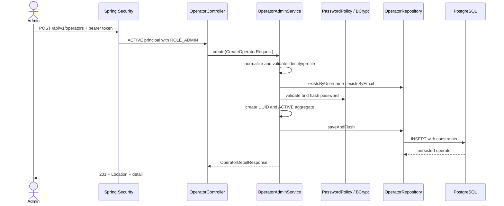

# Operator Management

## Purpose

An operator is the persisted identity of a person allowed to use ProofChain. The operator record combines a stable UUID and normalized login identity with profile data, a BCrypt password hash, one global role, and an operational status.

Identity answers which account is involved; role supplies the current global authority; status determines whether the account may authenticate. Persistence is essential because the database, not an already-issued JWT, is authoritative for current role and status. [Authentication](./Auth.md) consumes this model, while administrative creation and state changes belong to operator management.

## Operator model

[`Operator`](../src/main/java/it/itsprodigi/proofchain/operator/domain/Operator.java) is a JPA aggregate mapped to the `operators` table:

| Field | Persisted representation and rule |
| --- | --- |
| `id` | Random Java UUID; PostgreSQL `uuid`; immutable after creation. |
| `username` | 3–64 characters matching `[a-z0-9._-]+`; trimmed and lower-cased. |
| `email` | Valid email, at most 320 characters; trimmed and lower-cased. |
| `passwordHash` | Exactly 60 characters; contains a BCrypt hash, never the raw password. |
| `firstName`, `lastName` | Trimmed, non-blank, at most 100 characters each. |
| `role` | String-backed `OperatorRole`. |
| `status` | String-backed `OperatorStatus`; new operators start as `ACTIVE`. |
| `createdAt`, `updatedAt` | UTC `Instant` values persisted as `TIMESTAMPTZ`. |
| `version` | Non-negative JPA `@Version` value used for optimistic locking. |

[`OperatorNormalizer`](../src/main/java/it/itsprodigi/proofchain/operator/domain/OperatorNormalizer.java) uses `Locale.ROOT` for identity normalization and trims names without changing their case. Username and email are unique. The application checks for duplicates before inserting, and PostgreSQL named unique constraints remain the final protection against concurrent inserts.

The domain truncates timestamps to microsecond precision to match PostgreSQL. If a state change occurs before the clock advances, `updatedAt` moves forward by one microsecond. The timestamp is audit data; `version` is the concurrency authority. API responses deliberately omit both password hash and version.

## Roles

The frozen global roles are:

- `ADMIN` is the only role currently granted global operator-administration authority.
- `CASE_MANAGER` names the future case-coordination responsibility, but Sprint 1 assigns it no case endpoints or contextual permissions.
- `EVIDENCE_OFFICER` names the future evidence-handling responsibility, but evidence workflows are not implemented.
- `AUDITOR` names the future review responsibility, but no separate auditor API is implemented in this slice.

These labels establish the operator vocabulary without pretending that later features exist. In Sprint 1, Spring Security distinguishes `ADMIN` from all other roles for the administrative API. Future case authorization must model membership and case-specific privileges in the case feature rather than duplicate or reinterpret this global role field.

## Statuses

`OperatorStatus` contains `ACTIVE`, `SUSPENDED`, and `DISABLED`. Only `ACTIVE` operators can log in or continue using an issued token. Since every bearer request reloads the row, changing an operator to either inactive status takes effect on the next request.

The service allows an operator to be moved from `SUSPENDED` or `DISABLED` back to `ACTIVE`. It also accepts any enum-to-enum status change and treats a request for the current value as an idempotent no-op. The current code and ADRs do not define a distinct workflow, duration, or irreversibility rule for `SUSPENDED` versus `DISABLED`; both have the same authentication effect. This guide therefore does not invent a stronger semantic distinction.

## Administrative API

All endpoints are rooted at `/api/v1/operators`, require a valid bearer token, and are authorized for `ADMIN` at the application-service boundary.

| Method and path | Input | Success | Main errors and semantics |
| --- | --- | --- | --- |
| `POST /api/v1/operators` | `username`, `email`, `password`, `firstName`, `lastName`, `role` | `201 Created`; `Location` points to the new resource; body is `OperatorDetailResponse` | `400` validation; `409 duplicate-resource`. Creates an `ACTIVE` operator and is not idempotent. |
| `GET /api/v1/operators` | Query `page`, `size`, optional `sort=field,direction` | `200` with `OperatorPageResponse` | `400` for invalid pagination, repeated/malformed sort, unsupported field, or direction. Read-only. |
| `GET /api/v1/operators/{id}` | Operator UUID path parameter | `200` with `OperatorDetailResponse` | `400` invalid UUID; `404 resource-not-found`. Read-only. |
| `PATCH /api/v1/operators/{id}/role` | JSON `{ "role": "<OperatorRole>" }` | `200` with updated detail | `400` invalid/missing enum; `404` missing operator; `409` invariant or concurrent modification. The current value is an idempotent no-op. |
| `PATCH /api/v1/operators/{id}/status` | JSON `{ "status": "<OperatorStatus>" }` | `200` with updated detail | `400` invalid/missing enum; `404` missing operator; `409` invariant or concurrent modification. The current value is an idempotent no-op. |

Every endpoint can also return `401 authentication-required`, `401 invalid-token`/`expired-token`, or `403 access-denied` before its business result. There is no operator update for username, email, password, or name, and no hard-delete endpoint in the current controller.

`OperatorDetailResponse` contains `id`, username, email, names, role, status, and both timestamps. List items use `OperatorSummaryResponse`, which contains the same identity and role/status fields without timestamps.

## Access control

The URL security chain requires authentication for every operator route. It does not encode a separate `/operators/**` role matcher. Instead, all five [`OperatorAdminService`](../src/main/java/it/itsprodigi/proofchain/operator/application/OperatorAdminService.java) methods carry `@PreAuthorize("hasRole('ADMIN')")`, and `@EnableMethodSecurity` activates that rule.

This is a deliberate defense boundary: a caller must first establish an `ACTIVE` database-backed identity, then pass method authorization with the role currently loaded from PostgreSQL. Protection remains attached to the use case even if another controller invokes the service later. Authentication proves the current identity; authorization decides whether that identity may administer operators.

## Operator creation flow

The DTO first receives Jakarta Bean Validation for non-blank fields and a non-null role. The service then builds a canonical aggregate: username and email are lower-cased and trimmed, names are trimmed, domain length/pattern rules run, and Bean Validation checks the email and mapped constraints. Duplicate username or email is checked before BCrypt work.

The configured password policy validates code-point length and the 72-byte BCrypt boundary. The encoder hashes the accepted password with a new salt. `Operator.create` generates the UUID, sets `ACTIVE`, and initializes microsecond UTC timestamps and version zero. `saveAndFlush` forces persistence inside the transaction. If a concurrent insert passes the pre-check, the named database uniqueness constraint is translated to the same `duplicate-resource` response.

## Pagination and sorting

The list endpoint is zero-based. `page` defaults to `0`; `size` defaults to `20` and must be between `1` and `100`. With no sort query, ordering defaults to `username,asc`.

Exactly one public sort criterion is accepted. Its field allowlist is `username`, `email`, `firstName`, `lastName`, `role`, `status`, `createdAt`, and `updatedAt`; direction must be lower-case `asc` or `desc`. The service always appends `id,asc` as a deterministic tie-breaker. An allowlist prevents callers from reaching arbitrary persistence properties and keeps the HTTP contract stable when the entity changes.

`OperatorPageResponse` contains `content`, `page`, `size`, `totalElements`, `totalPages`, and a `sort` object with the accepted public field and direction. The internal UUID tie-breaker is not repeated in that public sort descriptor.

## Role changes

Only a current `ADMIN` can change a role. The request must contain one of the four enum values. A no-op request returns the current detail without changing `updatedAt` or `version`.

Changing the role of an `ACTIVE ADMIN` to a non-ADMIN role can reduce the protected administrator set, so the service first locks all `ACTIVE ADMIN` rows and refreshes the target. Self-demotion is allowed only when another `ACTIVE ADMIN` exists. An administrator may demote another active administrator only when the operation still leaves at least one. A violation returns `409 operator-invariant-conflict` and the transaction rolls back.

After a successful change, an already-issued token does not preserve the old authority. The next request reloads the new role. A demoted operator can still authenticate while `ACTIVE`, but ADMIN-only calls return `403`.

Individual updates also use the entity's JPA version. A stale concurrent update is translated to `409 concurrent-modification` with guidance to retry from current data.

## Status changes

Only a current `ADMIN` can change status. The current service permits every transition among `ACTIVE`, `SUSPENDED`, and `DISABLED`, including reactivation, and treats the current value as a no-op.

An `ACTIVE ADMIN` cannot suspend or disable itself, even if another active administrator exists. Suspending or disabling another `ACTIVE ADMIN` is permitted only when at least one remains. The service protects those decisions with the same lock-and-refresh strategy used for demotion.

A successful change to `SUSPENDED` or `DISABLED` prevents the next login and invalidates practical use of already-issued tokens on the next request because the filter reloads status. Reactivation restores bearer-request eligibility for an otherwise valid unexpired token; it does not issue a new token automatically.

## Last active administrator invariant

An `ACTIVE ADMIN` is an operator whose role is exactly `ADMIN` and status exactly `ACTIVE`. ProofChain must retain at least one because this is the only identity currently authorized to create operators or repair their role and status. Leaving none would lock the system out of its administrative API.

The risky operations are demoting an active administrator and changing an active administrator to `SUSPENDED` or `DISABLED`. Before either decision, [`OperatorRepository.lockActiveAdmins`](../src/main/java/it/itsprodigi/proofchain/operator/persistence/OperatorRepository.java) selects all current active administrators in UUID order with `PESSIMISTIC_WRITE`. The ordered lock serializes competing reductions. The service refreshes the target after acquiring the locks, rechecks whether the requested operation is still relevant, and then evaluates self-administration and remaining-count rules.

If the invariant would be violated, `OperatorInvariantException` exits the transactional method. Spring rolls back the transaction and [`GlobalExceptionHandler`](../src/main/java/it/itsprodigi/proofchain/common/exception/GlobalExceptionHandler.java) returns HTTP `409` with type `https://proofchain.dev/problems/operator-invariant-conflict`. The detail distinguishes self-demotion, self-deactivation, and an operation that would leave no active administrator.

The concurrency evidence is deliberately database-backed. [`ActiveAdminLockIT`](../src/test/java/it/itsprodigi/proofchain/operator/persistence/ActiveAdminLockIT.java) proves that competing lock queries serialize and use UUID order. [`LastActiveAdminConcurrencyIT`](../src/test/java/it/itsprodigi/proofchain/operator/LastActiveAdminConcurrencyIT.java) coordinates simultaneous demotions and status changes and verifies one active administrator remains. [`AuthenticationConcurrencyIT`](../src/test/java/it/itsprodigi/proofchain/operator/AuthenticationConcurrencyIT.java) exercises the same invariant through concurrent authenticated HTTP requests.

## Persistence and concurrency

[`OperatorRepository`](../src/main/java/it/itsprodigi/proofchain/operator/persistence/OperatorRepository.java) extends `JpaRepository<Operator, UUID>` and adds normalized-username lookup, duplicate pre-checks, an active-admin count, and the pessimistic-lock query. [`OperatorAdminService`](../src/main/java/it/itsprodigi/proofchain/operator/application/OperatorAdminService.java) places creation and changes in regular transactions; list and detail use read-only transactions.

[`V1__create_operators.sql`](../src/main/resources/db/migration/V1__create_operators.sql) defines the table, primary key, named unique username/email constraints, normalized identity checks, length and enum checks, non-negative version, and a partial active-ADMIN index. Flyway applies this migration; Hibernate validates it.

Duplicate pre-checks provide a clear early error and avoid unnecessary BCrypt work, but they cannot eliminate a race. The database unique constraints are the final authority, and named username/email violations are translated to `DuplicateOperatorException`. Other integrity failures are not mislabeled as duplicates.

`@Version` detects two transactions that update the same operator from stale state. The service flushes changes before returning and translates the optimistic-lock exception. The last-active-admin rule is different: it spans multiple rows, so it uses pessimistic locks in addition to each row's optimistic version.

## Error contracts

Operator errors use the shared Problem Details envelope with request instance and UTC timestamp.

| Situation | HTTP | Problem type | Contract note |
| --- | --- | --- | --- |
| Duplicate username or email | `409` | `https://proofchain.dev/problems/duplicate-resource` | One public response covers both fields and database races. |
| Missing operator | `404` | `https://proofchain.dev/problems/resource-not-found` | Used by detail and update operations. |
| Invalid DTO, UUID, enum, page, size, or sort | `400` | `https://proofchain.dev/problems/validation-error` | Bean-validation responses may include sorted `errors`; rejected values are not echoed. |
| Missing, invalid, or expired authentication | `401` | Authentication problem types described in [Authentication](./Auth.md#error-contracts) | Rejected before business execution. |
| Authenticated non-ADMIN | `403` | `https://proofchain.dev/problems/access-denied` | Enforced by method security and logged. |
| Last-active-admin or self-administration violation | `409` | `https://proofchain.dev/problems/operator-invariant-conflict` | Transaction rolls back; detail identifies the violated rule. |
| Stale optimistic update | `409` | `https://proofchain.dev/problems/concurrent-modification` | Client should retry from current data. |

There are no separate problem types for duplicate username versus duplicate email, and no separate problem type for `SUSPENDED` versus `DISABLED` authentication. The documentation preserves those intentional public abstractions.

## Testing coverage

- [`OperatorTest`](../src/test/java/it/itsprodigi/proofchain/operator/domain/OperatorTest.java) covers canonical identity, field validation, the frozen enums, microsecond timestamp updates, and safe string output.
- [`PasswordPolicyTest`](../src/test/java/it/itsprodigi/proofchain/operator/application/PasswordPolicyTest.java) covers production defaults, configurable boundaries, Unicode code points, the BCrypt byte limit, strengths, and salted hashes.
- [`OperatorAdminServiceTest`](../src/test/java/it/itsprodigi/proofchain/operator/application/OperatorAdminServiceTest.java) covers every role, duplicate pre-checks, ADMIN invariants, self-demotion, self-deactivation, reactivation, idempotent changes, sort allowlisting, and DTO exclusions.
- [`OperatorControllerWebMvcTest`](../src/test/java/it/itsprodigi/proofchain/operator/api/OperatorControllerWebMvcTest.java) verifies all five endpoints, `401`/`403`/`404`/`409` contracts, validation, response shapes, OpenAPI metadata, absence of a delete endpoint, and immediate token effects.
- [`OperatorRepositoryIT`](../src/test/java/it/itsprodigi/proofchain/operator/persistence/OperatorRepositoryIT.java) verifies Flyway schema shape, PostgreSQL types and constraints, normalized lookups, uniqueness, enum checks, and UTC timestamps through Testcontainers.
- [`OperatorAdministrationIT`](../src/test/java/it/itsprodigi/proofchain/operator/OperatorAdministrationIT.java) covers persistence, duplicate pre-checks and races, deterministic pagination/sorting, reactivation, and translated optimistic-lock conflicts.
- [`OperatorOptimisticLockIT`](../src/test/java/it/itsprodigi/proofchain/operator/persistence/OperatorOptimisticLockIT.java), [`ActiveAdminLockIT`](../src/test/java/it/itsprodigi/proofchain/operator/persistence/ActiveAdminLockIT.java), and [`LastActiveAdminConcurrencyIT`](../src/test/java/it/itsprodigi/proofchain/operator/LastActiveAdminConcurrencyIT.java) cover stale writes, row-lock serialization, and concurrent invariant preservation.
- [`BootstrapAdminIT`](../src/test/java/it/itsprodigi/proofchain/operator/application/BootstrapAdminIT.java) covers enabled/disabled bootstrap, normalization, BCrypt storage, sequential idempotency, and preservation of an existing active administrator.
- [`OperatorSecurityVerticalSliceIT`](../src/test/java/it/itsprodigi/proofchain/operator/OperatorSecurityVerticalSliceIT.java) certifies ADMIN operations, non-ADMIN denial, duplicate and last-admin Problem Details, and current database role/status for already-issued tokens.
- [`AuthenticationConcurrencyIT`](../src/test/java/it/itsprodigi/proofchain/operator/AuthenticationConcurrencyIT.java) verifies concurrent self-demotion through the authenticated vertical slice.

All integration tests inherit [`PostgreSqlIntegrationTest`](../src/test/java/it/itsprodigi/proofchain/support/PostgreSqlIntegrationTest.java), which supplies one shared PostgreSQL `18.4-trixie` Testcontainer and publishes its JDBC settings with `@DynamicPropertySource`.

## Relevant source files

- Domain and normalization: [`Operator`](../src/main/java/it/itsprodigi/proofchain/operator/domain/Operator.java), [`OperatorRole`](../src/main/java/it/itsprodigi/proofchain/operator/domain/OperatorRole.java), [`OperatorStatus`](../src/main/java/it/itsprodigi/proofchain/operator/domain/OperatorStatus.java), and [`OperatorNormalizer`](../src/main/java/it/itsprodigi/proofchain/operator/domain/OperatorNormalizer.java).
- HTTP API and DTOs: [`OperatorController`](../src/main/java/it/itsprodigi/proofchain/operator/api/OperatorController.java), [`CreateOperatorRequest`](../src/main/java/it/itsprodigi/proofchain/operator/api/CreateOperatorRequest.java), [`OperatorDetailResponse`](../src/main/java/it/itsprodigi/proofchain/operator/api/OperatorDetailResponse.java), and [`OperatorPageResponse`](../src/main/java/it/itsprodigi/proofchain/operator/api/OperatorPageResponse.java).
- Application rules: [`OperatorAdminService`](../src/main/java/it/itsprodigi/proofchain/operator/application/OperatorAdminService.java), [`OperatorMapper`](../src/main/java/it/itsprodigi/proofchain/operator/application/OperatorMapper.java), and [`PasswordPolicy`](../src/main/java/it/itsprodigi/proofchain/operator/application/PasswordPolicy.java).
- Persistence and schema: [`OperatorRepository`](../src/main/java/it/itsprodigi/proofchain/operator/persistence/OperatorRepository.java) and [`V1__create_operators.sql`](../src/main/resources/db/migration/V1__create_operators.sql).
- Bootstrap: [`BootstrapAdminRunner`](../src/main/java/it/itsprodigi/proofchain/operator/application/BootstrapAdminRunner.java), [`BootstrapAdminService`](../src/main/java/it/itsprodigi/proofchain/operator/application/BootstrapAdminService.java), and [`BootstrapAdminProperties`](../src/main/java/it/itsprodigi/proofchain/operator/application/BootstrapAdminProperties.java).
- Security and errors: [`SecurityConfig`](../src/main/java/it/itsprodigi/proofchain/common/config/SecurityConfig.java), [`JwtAuthenticationFilter`](../src/main/java/it/itsprodigi/proofchain/auth/security/JwtAuthenticationFilter.java), [`GlobalExceptionHandler`](../src/main/java/it/itsprodigi/proofchain/common/exception/GlobalExceptionHandler.java), and [`ProblemTypes`](../src/main/java/it/itsprodigi/proofchain/common/exception/ProblemTypes.java).

The underlying decisions are recorded in [ADR-002](./adr/ADR-002-sprint-1-baseline.md) and [ADR-003](./adr/ADR-003-authentication-and-operator-security.md).
