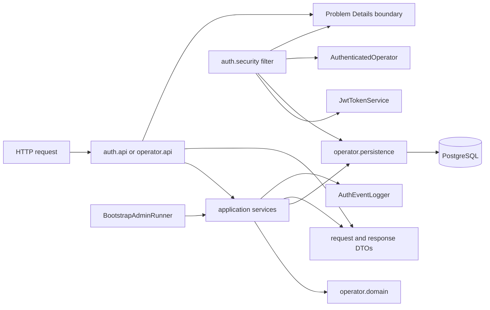

# ProofChain backend codebase guide

## Title and purpose

This guide documents the implemented ProofChain backend: its package structure, request flows, security boundaries, persistence model, transactions, tests, local infrastructure, and CI quality gate.

It covers the repository state represented by the `IJPC-140` Sprint 1 certification branch and PR #22: Maven project version `0.0.1-SNAPSHOT`, based on `main` plus the authentication vertical-slice certification changes in that branch. The repository is the ProofChain backend, implemented as a Spring Boot application.

The guide describes the architecture that is present in the code. It is not a specification of future functionality. In particular, the current slice is limited to authentication and operator management; custody and evidence workflows are not implemented here.

## System overview

ProofChain is a backend for managing the chain of custody of digital evidence. The implemented Sprint 1 slice establishes the identity and authorization foundation needed by later features:

- username/password login for operators;
- stateless bearer-token authentication with signed JWT access tokens;
- database-authoritative operator status and role checks;
- ADMIN-protected operator creation, listing, detail, role changes, and status changes;
- PostgreSQL persistence with Flyway-managed schema evolution;
- stable HTTP error responses using Spring Problem Details.

The application is a modular monolith. One Spring Boot runtime contains feature-first packages rather than separately deployed services. The `auth` and `operator` packages contain the implemented vertical slice. `common` contains shared configuration and cross-cutting HTTP/error contracts. `custodycase`, `custodyevent`, and `evidence` exist as feature boundaries, but contain no implemented feature classes in this repository.

Spring Boot starts the application and composes the web, persistence, validation, security, Flyway, and configuration components. Spring MVC exposes the controllers and DTO contracts. PostgreSQL stores the `operators` table. Flyway applies the immutable SQL migrations before Hibernate validates the mapped schema. Spring Security builds a stateless servlet filter chain, while the application JWT service issues and validates HS256 tokens. The JWT identifies an operator, but the database remains authoritative for the current operator record.

## Repository structure

The relevant repository areas are:

```text
.
├── .github/
│   ├── pull_request_template.md
│   └── workflows/quality.yml       # CI entry point for the Maven gate
├── docs/
│   ├── adr/                         # accepted architecture decisions
│   └── technical/codebase-guide.md  # this guide
├── src/main/java/it/itsprodigi/proofchain/
│   ├── ProofChainApplication.java
│   ├── auth/                        # login, JWT, request authentication, auth logging
│   ├── common/                      # shared configuration and Problem Details
│   ├── custodycase/                 # feature boundary; no implementation yet
│   ├── custodyevent/                # feature boundary; no implementation yet
│   ├── evidence/                    # feature boundary; no implementation yet
│   └── operator/                    # operator API, application rules, domain, persistence
├── src/main/resources/
│   ├── application.yml              # shared Spring and ProofChain properties
│   ├── application-local.yml        # local PostgreSQL profile
│   ├── db/migration/                 # Flyway SQL and migration rules
│   └── logback-spring.xml            # console and AUTH_AUDIT logging
├── src/test/java/                   # unit, MVC, persistence, and vertical-slice tests
├── src/test/resources/application-test.yml
├── compose.yml                      # local PostgreSQL only
├── mvnw, mvnw.cmd                   # Maven Wrapper entry points
├── pom.xml                          # dependencies, lifecycle, tests, coverage
├── README.md                        # concise project entry point
└── CONTRIBUTING.md                  # repository workflow and evidence rules
```

## Package and module responsibilities

The package names reflect the implementation rather than a separately enforced module system.

### `auth`

`auth.api` owns the HTTP login and current-operator endpoints and their records: `LoginRequest`, `LoginResponse`, and `CurrentOperatorResponse`. `AuthController` delegates authentication and maps the authenticated principal to a response DTO; it does not expose the JPA entity.

`auth.application` contains `AuthenticationService`, `JwtTokenService`, JWT properties and the application exceptions used for invalid credentials or tokens. `AuthenticationService` normalizes the login identifier, performs the BCrypt comparison, and asks `JwtTokenService` to issue an access token.

`auth.config` creates the validated JWT properties, UTC clock, and signing key from external configuration.

`auth.security` contains the request boundary. `JwtAuthenticationFilter` validates the bearer token, reloads the operator, creates `AuthenticatedOperator`, and installs a `UsernamePasswordAuthenticationToken`. `ProblemAuthenticationEntryPoint`, `ProblemAccessDeniedHandler`, and `SecurityProblemWriter` translate security failures into Problem Details.

`auth.logging` contains the closed authentication event model, the centralized `AuthEventLogger`, and `LogValueSanitizer`. It is the only application path used for the dedicated authentication audit logger.

### `operator`

`operator.api` contains `OperatorController` and explicit request/response records. The controller exposes create, page, detail, role-patch, and status-patch operations under `/api/v1/operators`.

`operator.application` contains `OperatorAdminService`, `OperatorMapper`, bootstrap-admin startup behavior, password policy, and domain/application exceptions. The service owns ADMIN authorization annotations, transaction boundaries, normalization and validation orchestration, conflict translation, and the last-active-ADMIN invariant.

`operator.domain` contains the JPA `Operator` aggregate, identity normalization, and the `OperatorRole` and `OperatorStatus` enums. The aggregate validates its own canonical state and maintains microsecond-precision timestamps.

`operator.persistence` contains `OperatorRepository`, including normalized-identity lookups, active-ADMIN counting, and the explicit pessimistic-lock query used by invariant-protecting operations.

### `common`

`common.config` contains the Spring Security filter-chain configuration, OpenAPI model, and BCrypt/password properties. `SecurityConfig` disables stateful or interactive authentication mechanisms and enables method security.

`common.exception` contains `GlobalExceptionHandler`, `ProblemDetailFactory`, the stable `ProblemTypes` URI set, validation error records, and the resource-not-found exception. It handles application-level errors that reach MVC after controller/service execution.

### Cross-cutting boundaries

`src/main/resources/application*.yml` externalizes runtime configuration. Flyway owns schema changes under `src/main/resources/db/migration`; `compose.yml` only provisions the local PostgreSQL service. The test support class provisions an independent PostgreSQL Testcontainer for integration tests.

## Dependency direction and boundaries

The implemented direction is feature-oriented:



Controllers depend on application services and DTOs. They do not serialize `Operator` directly. Application services use the domain aggregate and repository ports supplied by Spring Data. The repository maps the aggregate to PostgreSQL. Security may depend on the operator repository because the current database record is required to authenticate each bearer request.

The code does not introduce a separate domain-repository abstraction or a runtime module-enforcement plugin. The boundary is maintained through package ownership, explicit DTOs, and service/controller responsibilities. The persistence entity contains a BCrypt hash and a JPA version, while response records deliberately omit both; this prevents a persistence representation from becoming an HTTP contract.

Transactional boundaries are placed on application operations, not controllers. Read operations use read-only transactions; create and state-changing operations use regular transactions. Authentication login has a repository-scoped read transaction for its username lookup, while JWT request authentication performs the current-operator lookup inside the filter boundary.

## Authentication flow

`POST /api/v1/auth/login` is public. The implemented login sequence is:

1. `AuthController` receives a `LoginRequest` with non-blank `username` and `password` and passes it to `AuthenticationService`.
2. The username is trimmed and lower-cased with `Locale.ROOT` by `OperatorNormalizer`.
3. `OperatorRepository.findByUsername` loads the normalized operator, if present.
4. Password comparison always reaches BCrypt. Unknown users and passwords longer than 72 UTF-8 bytes use a prepared dummy hash; known users use the stored BCrypt hash.
5. The service requires the operator to be `ACTIVE` and the comparison to match. Unknown, inactive, overlong, and wrong-password cases all become `InvalidCredentialsException` and the same public 401 problem type.
6. For a valid operator, `JwtTokenService` issues an HS256 JWT using the external Base64 secret and the configured positive TTL. Issuance and expiration are truncated to seconds.
7. The token claims are allowlisted as `sub`, `username`, `role`, `iat`, `exp`, `jti`, and `iss`. `sub` is the operator UUID; `username` is normalized; `role` is the role at issuance; `jti` is a UUID version 4; and `iss` is the fixed issuer `proofchain-api`.
8. `AuthEventLogger` records `LOGIN_SUCCESS` only after token issuance. The controller returns HTTP 200 with `LoginResponse` fields `accessToken`, `tokenType`, `expiresAt`, and `expiresInSeconds`, plus `Cache-Control: no-store` and `Pragma: no-cache`.
9. Credential failure is logged as `LOGIN_FAILURE` with the reason code `INVALID_CREDENTIALS`. Passwords, hashes, complete tokens, and authorization headers are not passed to the logger.

JWT validation additionally requires the configured key, issuer, HS256 algorithm, the exact allowlisted claim set, a non-future `iat`, and an expiration after issuance. Expired and otherwise invalid tokens are represented by separate application exceptions so the HTTP boundary can expose the corresponding problem type.

## Authenticated request flow

For a non-public request, `JwtAuthenticationFilter` runs once per request before the anonymous authentication filter:

1. The filter clears any existing security context. With no `Authorization` header it leaves the request anonymous; the security chain later returns `authentication-required` for protected resources. Missing headers do not trigger an operator lookup.
2. Exactly one header value matching `Bearer [^\s,]+` is required. A malformed or duplicated bearer header is rejected as an invalid token.
3. The bearer value is validated by `JwtTokenService` for signature, algorithm, issuer, claims, timestamps, and expiration.
4. The UUID from the JWT subject is used for `OperatorRepository.findById`. This PostgreSQL lookup occurs for every request that presents a bearer token.
5. A missing operator or an operator whose current status is not `ACTIVE` is rejected with the invalid-token problem. The filter does not trust the token's role or status because those values are re-read from the database.
6. For an active record, the filter constructs an immutable `AuthenticatedOperator` from the current database fields and installs a `UsernamePasswordAuthenticationToken` with one `ROLE_<current role>` authority.
7. `SecurityConfig` applies URL authorization: login, OpenAPI, and Swagger resources are public; every other request requires authentication. `@EnableMethodSecurity` then applies service-level rules, including `@PreAuthorize("hasRole('ADMIN')")` on operator administration.
8. Missing authentication is written as HTTP 401 `authentication-required`; invalid and expired tokens are HTTP 401 with their respective problem types; authorization failure is HTTP 403 `access-denied`.

The chain is stateless: form login, HTTP Basic, remember-me, logout, CSRF, request caching, sessions, and automatic security-context persistence are disabled or replaced with stateless equivalents. The tests verify that an authenticated request creates neither a session nor a `Set-Cookie` response.

The current database record is therefore authoritative after token issuance. The integration tests reuse an already-issued token after changing the operator: a suspended or disabled operator receives HTTP 401, a deleted operator receives HTTP 401, and a demoted ADMIN still authenticates but receives HTTP 403 for an ADMIN-only operation. Reactivation and role changes are observed on the next request. This is why a valid signature alone does not grant current access.

## Operator management

The controller exposes the following operations under `/api/v1/operators`:

| Method | Path | Implemented operation |
| --- | --- | --- |
| `POST` | `/api/v1/operators` | Create an `ACTIVE` operator and return `201 Created` with a `Location` header. |
| `GET` | `/api/v1/operators` | Return a page of operator summaries. |
| `GET` | `/api/v1/operators/{id}` | Return operator details by UUID. |
| `PATCH` | `/api/v1/operators/{id}/role` | Change the target role. |
| `PATCH` | `/api/v1/operators/{id}/status` | Change the target status. |

All five service methods are protected with `@PreAuthorize("hasRole('ADMIN')")`. Creation normalizes username and email, validates names and role, validates the configured password policy, encodes the password with BCrypt, and returns an explicit detail DTO without password hash or JPA version. The role enum is `ADMIN`, `CASE_MANAGER`, `EVIDENCE_OFFICER`, or `AUDITOR`; the status enum is `ACTIVE`, `SUSPENDED`, or `DISABLED`.

Listing uses zero-based `page` (default `0`) and `size` (default `20`, allowed range `1..100`). One optional sort criterion is accepted in `field,direction` form. Allowed fields are `username`, `email`, `firstName`, `lastName`, `role`, `status`, `createdAt`, and `updatedAt`; directions are lowercase `asc` and `desc`. The service always appends ascending UUID `id` ordering as a deterministic tie-breaker. The response includes the page metadata and the accepted sort descriptor.

Username and email are normalized before lookup and persistence. The service pre-checks duplicates and translates races that reach the named database unique constraints into the duplicate-resource conflict. The database also enforces the canonical formats, lengths, enum values, non-negative version, and uniqueness. There is no delete endpoint in the current controller.

When a change could reduce the set of active ADMIN operators, the service locks all active ADMIN rows using the repository's `PESSIMISTIC_WRITE` query and refreshes the target before deciding. An ADMIN cannot suspend or disable itself. Self-demotion requires another active ADMIN, and any role or status change that would leave no active ADMIN is rejected as an operator-invariant conflict. The concurrent integration tests exercise the lock and assert that the invariant remains intact.

## Persistence and schema management

PostgreSQL is the persistence database. Flyway is the only schema authority. `V1__create_operators.sql` creates the `operators` table, and `spring.flyway.baseline-on-migrate=false` ensures a new database is expected to receive the versioned migration rather than an implicit baseline. Hibernate is configured with `ddl-auto: validate`; it checks the mapped schema and does not create or alter it.

The `Operator` entity maps the following persisted state: UUID `id`; normalized `username` and `email`; a 60-character BCrypt `password_hash`; names; string-backed `role` and `status`; UTC `created_at` and `updated_at`; and a non-negative `version`. The repository provides normalized username lookup, identity existence checks, active-ADMIN counting, and the ordered pessimistic active-ADMIN query.

Java `UUID` maps to PostgreSQL `uuid`. `Instant` values are persisted as PostgreSQL `TIMESTAMPTZ`, with Hibernate configured for UTC. The domain truncates creation and update timestamps to `ChronoUnit.MICROS`, matching PostgreSQL precision. If the clock does not advance, `Operator.touch()` advances the value by one microsecond. Timestamps are audit data; the JPA `@Version` field is the authoritative optimistic-concurrency mechanism.

Database constraints provide the final persistence boundary: primary key, unique username/email, normalized identity checks, length and format checks, allowed role/status values, fixed hash length, trimmed names, and non-negative version. The partial index `ix_operators_active_admin_id` supports the active-ADMIN query.

Related decisions:

- [ADR-001 — Foundation baseline](../adr/ADR-001-foundation-baseline.md) records Java/Spring/Maven, PostgreSQL, Flyway, external configuration, UTC, Problem Details, formatting, and quality-gate choices.
- [ADR-002 — Sprint 1 baseline](../adr/ADR-002-sprint-1-baseline.md) records the microsecond timestamp contract and the role of `@Version`.
- [ADR-003 — Authentication and operator security](../adr/ADR-003-authentication-and-operator-security.md) records JWT, password, database-authoritative authorization, locking, HTTP, and authentication logging decisions.

## Transactions and concurrency

The application service defines the transaction boundaries:

- `OperatorAdminService.create`, `updateRole`, and `updateStatus` are regular `@Transactional` operations.
- `OperatorAdminService.list` and `get` are `@Transactional(readOnly = true)` operations.
- `BootstrapAdminService.bootstrap` is `@Transactional`; completion logging is registered with `afterCommit` when a transaction synchronization is active.
- `OperatorRepository.findByUsername` is a read-only repository operation used by login. The request filter performs its current-operator lookup as part of the authenticated request boundary.

Create and state-changing operations are atomic with their validation, entity mutation, flush, and transaction outcome. The last-active-ADMIN check is not only an application count: potentially reducing operations first lock all current active ADMIN rows with `PESSIMISTIC_WRITE`, refresh the target, and then evaluate the invariant. The database partial index supports that selection, while the invariant decision itself is application logic protected by the row lock.

Individual operator updates also carry the JPA `@Version` value. A stale flush raises an optimistic-locking failure and the service/global handler exposes HTTP 409 with `https://proofchain.dev/problems/concurrent-modification`. Concurrent unique-identity races are protected by database unique constraints and translated to the duplicate-resource problem. The tests demonstrate the expected race outcomes; they do not claim a general distributed lock or a broader concurrency guarantee beyond these operations.

## Error handling and Problem Details

Application and security failures use `application/problem+json`. `ProblemDetailFactory` creates the standard status, type, title, detail, and request instance fields and adds a UTC `timestamp`. `GlobalExceptionHandler` is the MVC `@RestControllerAdvice` for application exceptions; security filter failures use `SecurityProblemWriter` so they can be written before controller dispatch.

The implemented problem types are:

- `authentication-required` and `invalid-credentials` for authentication failures;
- `invalid-token` and `expired-token` for bearer-token failures;
- `access-denied` for authorization failures;
- `validation-error` for request binding, enum, UUID, page, size, and sort validation;
- `resource-not-found` for missing resources;
- `duplicate-resource` for duplicate operator identity;
- `operator-invariant-conflict` for last-ADMIN and self-administration rules;
- `concurrent-modification` for optimistic-concurrency conflicts;
- `internal-server-error` for unexpected failures.

Validation field errors are returned in an `errors` property sorted by field, code, and message. Unexpected errors expose a generic detail while the server logs the exception class and request path. Persistence errors are translated selectively: named username/email constraint violations become duplicate-resource conflicts, optimistic-locking failures become concurrent-modification conflicts, and the implemented operator invariants become operator-invariant conflicts.

Examples verified by controller and integration tests:

```json
{
  "type": "https://proofchain.dev/problems/invalid-credentials",
  "title": "Invalid credentials",
  "status": 401,
  "detail": "The supplied credentials are invalid.",
  "instance": "/api/v1/auth/login"
}
```

```json
{
  "type": "https://proofchain.dev/problems/authentication-required",
  "title": "Authentication required",
  "status": 401,
  "detail": "Authentication is required to access this resource.",
  "instance": "/api/v1/auth/me"
}
```

The `timestamp` field is also present in generated responses; it is omitted above to keep the examples stable and non-time-specific.

## Authentication logging

Authentication events use the closed `AuthEvent.Event` set: `LOGIN_SUCCESS`, `LOGIN_FAILURE`, `INVALID_TOKEN`, `EXPIRED_TOKEN`, `ACCESS_DENIED`, `INACTIVE_OPERATOR_ACCESS`, `BOOTSTRAP_ADMIN_COMPLETED`, and `BOOTSTRAP_ADMIN_SKIPPED`.

The `AUTH_AUDIT` logger writes at INFO level to the local `auth.log` file configured by `logback-spring.xml`. Its additivity is disabled, so these events do not propagate to the normal console root logger. The stable field order is:

```text
event=<EVENT> operatorId=<UUID|-> username=<VALUE|-> role=<ROLE|-> outcome=<OUTCOME> reason=<CODE|-> path=<PATH|->
```

User-influenced values are sanitized centrally: ISO control characters are removed, usernames are limited to 64 code points, paths to 512, reasons to 128, and an email-like username is represented as `-`. Missing values are represented as `-`.

The logger is an operational diagnostic boundary, not an authentication database or production retention system. Passwords, password hashes, complete JWTs, JWT signatures, signing secrets, `Authorization` headers, and request bodies are not supplied to it. Logging failures are swallowed by `AuthEventLogger` so the logging backend cannot change an authentication result. The vertical-slice tests attach a per-test in-memory appender, assert expected events, detach it after each test, and check that sensitive material is absent.

## OpenAPI documentation

The repository uses `springdoc-openapi-starter-webmvc-ui:3.0.2`. `OpenApiConfig` creates the `ProofChain API` document at version `0.0.1`, describes the chain-of-custody REST API, declares the MIT license, adds the global `bearerAuth` requirement, and defines an HTTP bearer scheme with JWT format.

The generated document is exposed without authentication at `/v3/api-docs`; Swagger UI is exposed at `/swagger-ui/index.html` (with `/swagger-ui.html` also permitted by the security configuration). Controller annotations provide operation descriptions, DTO schemas, response codes, media types, and endpoint-level security metadata. Login explicitly removes the global bearer requirement, while `/api/v1/auth/me` and all operator endpoints document bearer authentication. `OpenApiIntegrationTest` and the vertical-slice tests verify these URLs and security entries.

## Configuration model

`src/main/resources/application.yml` is the shared configuration. It selects the `local` profile by default, uses UTC for Jackson and Hibernate, formats MVC date-time values as ISO, enables Flyway at `classpath:db/migration`, disables Hibernate schema generation with `ddl-auto: validate`, disables Open EntityManager in View, and configures multipart limits. The configured storage root is a foundation property; no evidence or file-processing feature is implemented in this slice.

`application-local.yml` supplies the local PostgreSQL connection using these environment variables and defaults:

| Property | Environment variable | Default or requirement |
| --- | --- | --- |
| `spring.datasource.url` | `DB_HOST`, `DB_PORT`, `DB_NAME` | `localhost`, `5432`, `proofchain` |
| `spring.datasource.username` | `DB_USERNAME` | `proofchain` |
| `spring.datasource.password` | `DB_PASSWORD` | Required; Spring rejects an unset value. |

Shared ProofChain properties are:

- `proofchain.jwt.secret` from `PROOFCHAIN_JWT_SECRET`: standard Base64 decoding to at least 32 bytes is required.
- `proofchain.jwt.access-token-ttl` from `PROOFCHAIN_JWT_ACCESS_TOKEN_TTL`, default `PT30M`.
- `proofchain.password.min-length`, `max-length`, and `bcrypt-strength` from the corresponding `PROOFCHAIN_PASSWORD_*` variables, defaulting to 12, 128, and 12. Passwords must also fit the BCrypt 72-byte UTF-8 boundary.
- `proofchain.bootstrap.admin.enabled`, `username`, `email`, and `password` from `PROOFCHAIN_BOOTSTRAP_ADMIN_*`. Bootstrap is disabled by default; when enabled, it creates one normalized, active ADMIN only when no active ADMIN exists.
- `proofchain.storage.root` from `PROOFCHAIN_STORAGE_ROOT`, default `./storage`.
- `spring.servlet.multipart.max-file-size` and `max-request-size` from `PROOFCHAIN_MAX_FILE_SIZE`, default `50MB`.

The test profile supplies a safe test JWT secret, reduces BCrypt strength to 4, and has its datasource values overridden by `PostgreSqlIntegrationTest` with the shared Testcontainer JDBC URL. Local `.env` values are external inputs; secrets and local logs remain ignored by Git.

## Testing architecture

Fast tests use the `*Test.java` convention and are selected by Maven Surefire because the POM excludes `**/*IT.java`. They include pure unit tests, controller/MockMvc tests, security-boundary tests, and application-service tests. Integration tests use the `*IT.java` convention and are selected by Maven Failsafe; they start the Spring context and use PostgreSQL Testcontainers rather than the local Compose database.

`PostgreSqlIntegrationTest` starts one static `postgres:18.4-trixie` container and publishes its JDBC properties with `@DynamicPropertySource`. This shared lifecycle avoids creating a new database port per test class while Spring reuses contexts. Integration coverage includes Flyway schema bootstrap, repository constraints and mappings, database-backed authentication, OpenAPI exposure, operator administration, and the authentication and operator security vertical slices.

The authentication tests cover login, normalized credentials, inactive operators, JWT issuance and validation, filter behavior, current database identity, Problem Details, OpenAPI security metadata, and sanitized authentication events. The operator tests cover ADMIN authorization, explicit DTOs, pagination/sorting, duplicate conflicts, role/status changes, bootstrap, last-active-ADMIN rules, optimistic locking, and concurrent requests. Concurrency tests use executors, latches, futures, PostgreSQL row locks, and real transactions to coordinate races.

JaCoCo prepares coverage, writes the HTML report, and enforces the POM's bundle line `COVEREDRATIO` minimum of `0.51` during `verify`. Surefire and Failsafe write reports under `target/surefire-reports/` and `target/failsafe-reports/`; JaCoCo writes under `target/site/jacoco/`.

The canonical verification command is:

```bash
./mvnw --batch-mode --no-transfer-progress clean verify
```

A separate reproducible operational testing guide is not present in this repository; this architectural overview intentionally does not link to a missing document.

## Build, local infrastructure, and CI

The Maven Wrapper uses Maven distribution `3.9.9`; the project build targets Java 25 and Spring Boot `4.0.7`. `pom.xml` owns formatting checks, compilation, Surefire, Failsafe, packaging, Spring Boot packaging, and JaCoCo. Spotless `3.6.0` with `palantir-java-format 2.78.0` checks Java and repository Markdown/YAML/XML formatting during `validate`.

`compose.yml` starts exactly one service: PostgreSQL `18.4-trixie`, with configurable database/user/password/port values, a health check, and the `proofchain-postgres-data` volume. It does not start the Spring Boot application. Start the application separately with the Maven Wrapper after exporting the local database and JWT configuration.

The `Quality` GitHub Actions workflow runs on pull requests and pushes to `main`. It checks out the source, provisions Temurin Java 25 with Maven caching, and invokes the same batch `clean verify` command. It has read-only repository contents permission and does not apply formatting or modify source files. When available, it uploads these artifacts for seven days:

- `jacoco-report` from `target/site/jacoco/`;
- `surefire-reports` from `target/surefire-reports/`;
- `failsafe-reports` from `target/failsafe-reports/`.

## Architectural decisions

The complete decision records remain in `docs/adr/`; this guide only indexes them:

| ADR | Decision |
| --- | --- |
| [ADR-001 — Foundation baseline](../adr/ADR-001-foundation-baseline.md) | Java/Spring/Maven baseline, feature-first modular monolith, PostgreSQL/Flyway, external configuration, UTC, Problem Details, formatting, and the canonical quality command. |
| [ADR-002 — Sprint 1 baseline](../adr/ADR-002-sprint-1-baseline.md) | Microsecond-normalized persisted timestamps and `@Version` as the optimistic-concurrency authority. |
| [ADR-003 — Authentication and operator security](../adr/ADR-003-authentication-and-operator-security.md) | JWT boundary, BCrypt/password policy, database-authoritative authorization, ADMIN management, locking, HTTP problem contracts, and auth logging. |

## Current limitations and next boundaries

The verified current boundary is Sprint 1 authentication and operator management. The repository does not yet implement custody cases, custody events, evidence records, file processing, refresh tokens, token revocation, server-side logout, MFA, an authentication audit table, production log retention/shipping, SIEM integration, metrics, dashboards, or distributed tracing. The `custodycase`, `custodyevent`, and `evidence` packages are only feature boundaries at this revision.

Custody cases and membership are Sprint 2 scope and must not be treated as available backend functionality in Sprint 1 documentation. Future work that changes these boundaries must update the relevant code, tests, and documentation together.

## Maintenance rule

The final certification subtask of every sprint must update this guide for the architecture actually delivered in that sprint. Architectural changes must also be recorded in an ADR when the change is an approved decision rather than an implementation detail. `README.md` and this guide must remain consistent with the current code, configuration, tests, migrations, and CI workflow.
