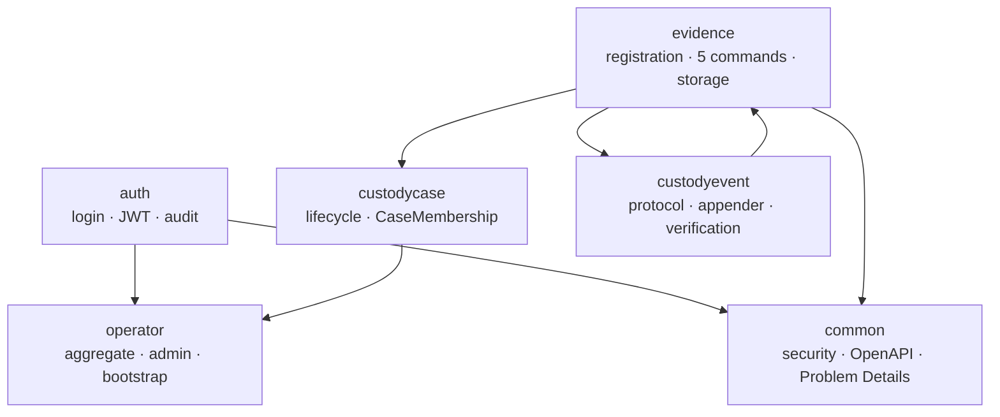
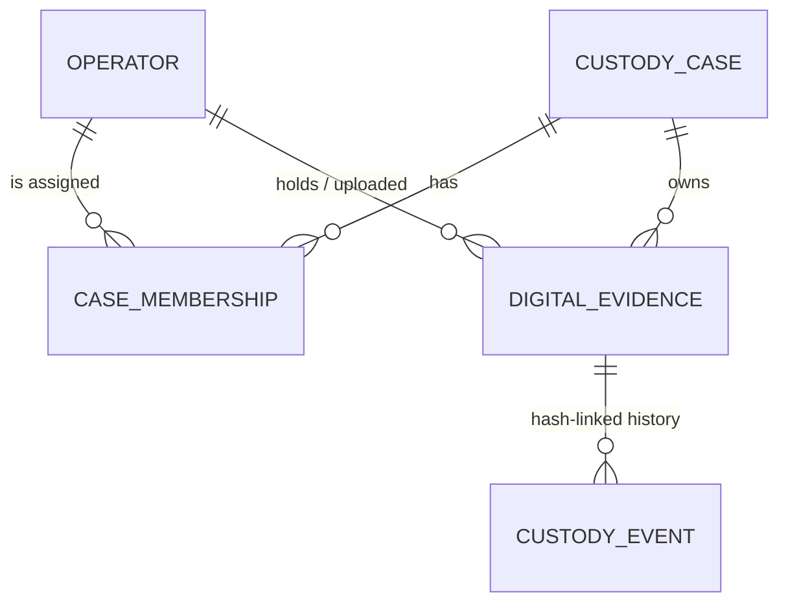
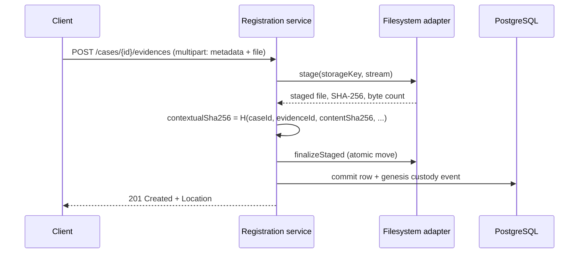
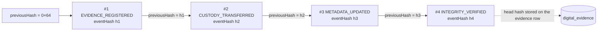
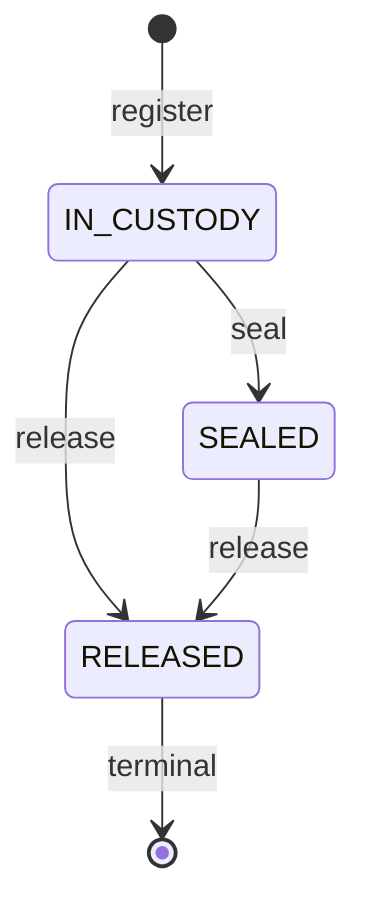
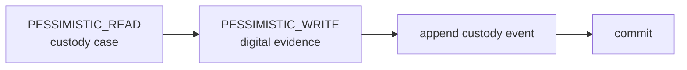
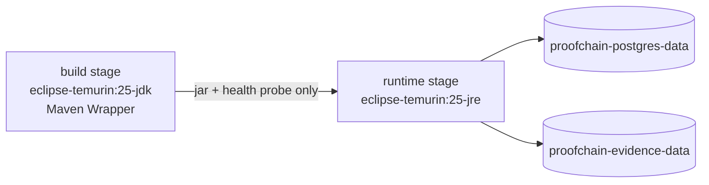

# ProofChain — presentation source

Version-controlled source for the ProofChain `1.0.0` technical talk: **12 slides, roughly 20 minutes**, followed by the
live demonstration in [`docs/Demo-Guide.md`](../docs/Demo-Guide.md).

This is Markdown with Mermaid diagrams and nothing else. It renders as-is on GitHub, and `---` separates slides for any
Markdown presenter (Marp, reveal-md, Slidev, Pandoc). **The Java build has no presentation dependency and never
generates slides**, and no exported deck is committed.

Every claim below is taken from the repository documentation — principally the
[technical report](../docs/Technical-Report.md), [architecture](../docs/Architecture.md) and
[ITS compliance](../docs/ITS-Compliance.md). Nothing here is stronger than what those documents support. In particular
ProofChain is **not** production-certified, offers **no** SLA, availability or throughput commitment, is **not** a
blockchain and uses **no** distributed consensus, and implements **no** digital signature, timestamping authority or
malware scanning.

---

## Slide 1 — Problem and objective

### ProofChain

**Chain-of-custody backend for digital evidence** · release `1.0.0` · ITS delivery

A chain of custody is the auditable record of *who held a piece of evidence, when, and what was done to it*. Digital
evidence adds one obligation: proving that **the bytes themselves did not change** while they were held.

A spreadsheet or a mutable database row cannot prove that. Both can be edited afterwards without leaving a trace.

**Objective — deliberately narrow:**

1. persist custody cases, operators, evidence metadata and evidence content under explicit authorization;
2. bind each stored file to its metadata with reproducible SHA-256 values computed at registration;
3. record every operational act as an **append-only, hash-linked** custody event;
4. make both the file and the event history **verifiable on demand**, with a machine-readable verdict.

> It is a complete, tested backend — **not a product**. No production certification, no availability or throughput
> commitment, no legal guarantee about admissibility.

---

## Slide 2 — Architecture and stack

One deployable Spring Boot application, partitioned **by business feature**, not by technical layer and not into
services.



| Component | Version |
| --- | --- |
| Java | 25 |
| Spring Boot | 4.0.7 (`webmvc`, Security, Data JPA, Actuator) |
| PostgreSQL | 18.4 — the only supported database |
| Schema | Flyway `V1`–`V7`; Hibernate `ddl-auto: validate` |
| API docs | springdoc-openapi 3.0.2, generated from the live mappings |
| Tests | JUnit 5, Testcontainers 1.21.4, JaCoCo 0.8.15 |

**Why a monolith:** the hardest correctness requirement is *"the aggregate mutation and its custody event either both
commit or neither does"*. That is one database transaction. Splitting it across services replaces a transaction with a
distributed protocol for no benefit inside this scope.

---

## Slide 3 — Domain and security model



Five aggregates. `CaseMembership` is an **explicit join entity** — it carries `assignedBy`, `assignedAt` and a unique
`(case_id, operator_id)` constraint, which a plain `@ManyToMany` cannot express.

**Authentication.** Username/password login issues a stateless JWT. The token carries a signed operator identifier and
nothing else — **role and status are re-read from PostgreSQL on every authenticated request**, so a suspension takes
effect on the next call.

**Authorization, in layers that never leak into each other:**

| Layer | Answer |
| --- | --- |
| Not `ADMIN` and not a case member, **or** the resource does not exist | `404` — byte-identical in both cases |
| Visible, but the role may not perform the command | `403` |
| Holder ineligible for any reason | one constant `409` — never an existence oracle |

| Command | ADMIN | member CASE_MANAGER | member EVIDENCE_OFFICER | member AUDITOR |
| --- | --- | --- | --- | --- |
| transfer | yes | yes | only while current holder | no |
| metadata update | yes | yes | yes | no |
| verify integrity | yes | yes | yes | **yes** |
| seal | yes | yes | only while current holder | no |
| release | yes | yes | no | no |

---

## Slide 4 — Storage and integrity hashes



- The digest is computed **server-side over the bytes actually received**. There is no client-supplied hash field.
- **`contentSha256`** identifies the bytes. **`contextualSha256`** additionally binds the case and evidence
  identifiers, so identical bytes registered in two cases are two distinct records.
- Storage paths are derived from identifiers — `cases/{caseId}/evidences/{evidenceId}/content.bin` — **never** from the
  uploaded filename. Symlinks, non-regular files and paths outside the resolved root are refused.
- The file is written and atomically moved **before** the transaction commits, so a crash can leave a file with no row,
  never a row with no file.
- `POST /verify-integrity` re-reads the stored file in one streaming pass and recomputes both the digest and the byte
  count. A mismatch is a **completed verification** returning `200 OK` with `valid: false` — never an error, and
  **never a repair**. Nothing in the system rewrites, quarantines or deletes evidence content.

---

## Slide 5 — The append-only custody chain



- One independent chain **per evidence item**, starting from the zero hash.
- Each event hash covers a **canonical JSON payload** — sorted keys, fixed number and instant formats — so the same
  event always hashes to the same value. The protocol is pinned by a fixed test vector.
- Events are written by **one** server-side appender, inside the business transaction they describe. There is no
  endpoint that appends an event directly.
- Immutability is enforced three times over: a PostgreSQL `BEFORE UPDATE OR DELETE` trigger that raises
  `custody_events are append-only`, JPA mappings with no update path, and the absence of any write route.
- `POST /verify-chain` recomputes every hash, re-links the chain and compares the result with the head hash on the
  evidence row. Failure returns one of **twelve closed-vocabulary reasons** — `SEQUENCE_GAP`, `PREVIOUS_HASH_MISMATCH`,
  `EVENT_HASH_MISMATCH`, `CHAIN_HEAD_MISMATCH`, … — evaluated in a fixed precedence order, with the expected and actual
  values.

> Say it precisely: this is an **unkeyed SHA-256 chain inside one PostgreSQL database**. It is tamper-*evidence*.
> It is **not** a blockchain, there is **no** distributed consensus, **no** external anchoring and **no** digital
> signature.

---

## Slide 6 — Operational workflows

Evidence changes only through **five named commands**. There is no generic command endpoint and no bulk operation.



| Command | Changes | Notes |
| --- | --- | --- |
| `POST .../transfer` | current holder | not a lifecycle transition; sealed evidence stays transferable |
| `PATCH .../metadata` | 14 descriptive fields | requires `IN_CUSTODY`; never touches file, hashes or holder |
| `POST .../verify-integrity` | nothing | re-reads the bytes; valid **and** invalid are both `200` |
| `POST .../seal` | `IN_CUSTODY → SEALED` | holder unchanged and must still be eligible |
| `POST .../release` | `→ RELEASED`, holder cleared | irreversible; management only |

Each command appends **exactly one** custody event, in the same transaction, with one shared server instant.

The lifecycle graph is enforced a second time by a PostgreSQL trigger, so even a manual repair session cannot unseal or
restore custody. **There is no unseal, no reopen, no undo and no evidence deletion anywhere in the system.** Case
closure is irreversible and blocks every write in the case — while reads, downloads, the timeline and chain
verification keep working.

---

## Slide 7 — Transactions, locking and concurrency

Every operational command takes the **same frozen lock order**:



- One order, always — case first, evidence second. A fixed order is what makes deadlock impossible between the five
  commands.
- Authorization is re-evaluated from **committed database state inside the command transaction**, after the case is
  locked and the operator row refreshed. A JWT identifies the caller; PostgreSQL decides.
- The current-holder condition is checked only **after** the evidence write lock is held, because the holder is not
  trustworthy until the aggregate is locked.
- A PostgreSQL `lock_timeout` is applied to every pooled connection. **No silent retry** anywhere: a conflict is
  reported, not absorbed.
- Rollback is total. A failed command leaves neither a mutated aggregate nor a partial event — the event and the
  mutation share one transaction by construction.
- Concurrency is proved by deterministic tests that coordinate two real transactions and observe `pg_stat_activity`,
  not by sleeps.

---

## Slide 8 — Testing and coverage

| Runner | Classes | Tests | Failures | Errors | Skipped |
| --- | --- | --- | --- | --- | --- |
| Surefire (`*Test.java`) | 53 | **443** | 0 | 0 | **4** |
| Failsafe (`*IT.java`) | 47 | **377** | 0 | 0 | 0 |

**JaCoCo line coverage 91.66 %** (4 167 / 4 546) against a `BUNDLE / LINE / COVEREDRATIO` gate of **0.51**. The gate has
never been lowered and **no class is excluded** — the plugin configuration contains no `<excludes>` element at all.

- Integration tests provision their **own** PostgreSQL 18.4 through Testcontainers; they never touch the Compose stack.
- The hash protocol is pinned by a **fixed vector**, so a canonicalization change breaks the build.
- Failure injection is real: migration failure, unreadable storage, disk-level errors, log and response leak audits.
- The four skips are honest: two storage classes assert POSIX permission behaviour and abort through JUnit
  `Assumptions` because the build runs as `root`. **No test was disabled to make the build green.**

One command, locally and in CI:

```bash
./mvnw --batch-mode --no-transfer-progress clean verify
```

---

## Slide 9 — Docker and reproducibility



Two-stage image; no sources, no Maven cache and no wrapper cross the boundary.

- Runs as **non-root `10001:10001`** on a **read-only root filesystem**, `cap_drop: ALL`, `no-new-privileges`.
- The only writable paths are the evidence volume and a bounded `tmpfs` at `/tmp` (`noexec,nosuid,nodev`).
- The jar is owned by `root`, so the process cannot rewrite its own code. The Docker socket is never mounted.
- Two independent named volumes: database state and evidence content are never entangled.
- The application container starts only after the PostgreSQL healthcheck — no sleep, no retry loop.
- **No restart policy, deliberately.** A bad secret or an unusable storage root must stay down and visible instead of
  looping. Startup fails fast on an invalid JWT secret, a wildcard CORS origin or an unusable storage root; it never
  degrades.
- Secrets come only from the environment. Nothing is generated, nothing is defaulted, and **no credential is tracked** —
  `.env` is git-ignored and `.env.example` holds unusable placeholders.

This is a **local, single-instance** runtime. No clustering, no reverse proxy, no TLS termination and no cloud
deployment are delivered or claimed.

---

## Slide 10 — Live demo plan

Full procedure: [`docs/Demo-Guide.md`](../docs/Demo-Guide.md). ~12–15 minutes, from an empty database.

**Preparation** — destructive reset, then preflight; deterministic synthetic fixtures only.

**Part A, 28 steps**, positive and negative interleaved at the lifecycle moment where each refusal matters:

| | |
| --- | --- |
| health · readiness · OpenAPI | `401` without a token |
| admin login · four operators created through the API | `403` for operator administration |
| case creation · membership assignment | `403` for a role that may not create cases |
| multipart upload with an initial holder | `413` oversized multipart |
| **byte-for-byte download parity** | `404` hidden **indistinguishable from** `404` nonexistent |
| timeline · valid chain verification | `409` no-op transfer |
| transfer · metadata update · **valid integrity verification** | `409` sealing twice |
| seal · release with the holder cleared | `409` mutation after release |
| case closure · continued read access | `409` mutation after closure |

**Part B — tampering, disposable environments only.** Invalid file integrity and invalid chain verification. Each
tampering step is an **explicit human checkpoint**: no script in the repository performs it, and a full reset is
mandatory afterwards.

**Part C — mandatory reset.** Removes only this project's containers, network and two named volumes.

A semi-automated alternative exists: the delivered Postman collection, 97 requests and 200 assertions, run with pinned
Newman.

---

## Slide 11 — ITS compliance and deliberate deviations

The full factual mapping is in [ITS compliance](../docs/ITS-Compliance.md). Four items need explicit acknowledgement:

| # | Item | Position |
| --- | --- | --- |
| 1 | **PostgreSQL instead of MySQL** | The rubric asks for MySQL. The dependency is genuine, not cosmetic: `JSONB` payloads, partial and expression indexes, `FOR SHARE`/`FOR UPDATE` semantics, `pg_stat_activity` concurrency proofs and PL/pgSQL triggers. Presented as a deviation, **not** as a compliant equivalent. |
| 2 | **No `@OneToOne`** | No pair of entities in this domain is one-to-one. Adding one to satisfy a checklist would create a table with no reason to exist. |
| 3 | **No `@ManyToMany`** | The case↔operator association **is** many-to-many, modelled as the attributed join entity `CaseMembership`. `@ManyToMany` cannot carry `assignedBy`/`assignedAt` or the unique constraint. |
| 4 | **No vulnerability scan** | The pinned `dependency-check` profile exists, but the NVD feeds are egress-blocked here. **No vulnerability analysis was performed and no zero-vulnerability claim may be inferred.** |

Delivered against the rubric: layered architecture, JPA with `@OneToMany`/`@ManyToOne`, Flyway-managed relational
schema, Spring Security with roles, REST API with OpenAPI, containerised runtime, automated tests with coverage
evidence, ADRs, and a documented, reproducible build.

The delivery tag `uf14-final-2026` is the Project Owner's acceptance action and **does not exist in the repository
yet**.

---

## Slide 12 — Conclusion and limitations

**What was built:** a modular monolith that makes custody of digital evidence *inspectable*. Every act is a named
command, every command appends exactly one hash-linked event in the same transaction, and both the file and the history
can be verified on demand with a precise machine-readable verdict.

**What it deliberately is not:** production-certified · no SLA, availability or throughput commitment · no cloud
deployment or clustering · no blockchain, no distributed consensus, no external anchoring · no digital signature or
timestamping authority · no malware scanning · no frontend · no repair, undo, unseal, reopen or deletion.

**Known limitations — from [Technical report §16](../docs/Technical-Report.md#16-known-limitations-and-future-work):**

1. PostgreSQL only; the MySQL rubric item is an acknowledged deviation.
2. No vulnerability scan was executed for this release.
3. A zero-byte stored file is reported as a technical inability (`500`) rather than a completed `valid: false`, because
   the frozen payload requires a positive `fileSize`.
4. Descriptive metadata is not surrogate-validated: an unpaired surrogate in `title` surfaces as an undeclared `500`.
   The transaction rolls back fully, but the status code is wrong and the failure is late.
5. Integrity verification stamps `updatedAt` although it is declared non-mutating.
6. A wrong HTTP method returns the sanitized generic `500`, not `405`, on every path except `GET /auth/login`.
7. The Postman collection cannot produce the `INVALID` integrity verdict; observing it requires the manual,
   human-gated step in the demo guide.
8. Four Surefire tests skip because the build runs as `root` and POSIX permission bits are not enforced for it.
9. Case-closure concurrency has no dedicated deterministic test; closed-case rejection is covered non-concurrently.
10. Seven Testcontainers-backed classes are named `*Test` and therefore run under Surefire.

**Future work, none of it started:** surrogate validation, the `405` fix, a payload version 2 tolerating zero-byte
files, executing Dependency-Check where the NVD is reachable, and the `*Test` → `*IT` rename.

> The defects above are published, not hidden. That is the point of the delivery.
